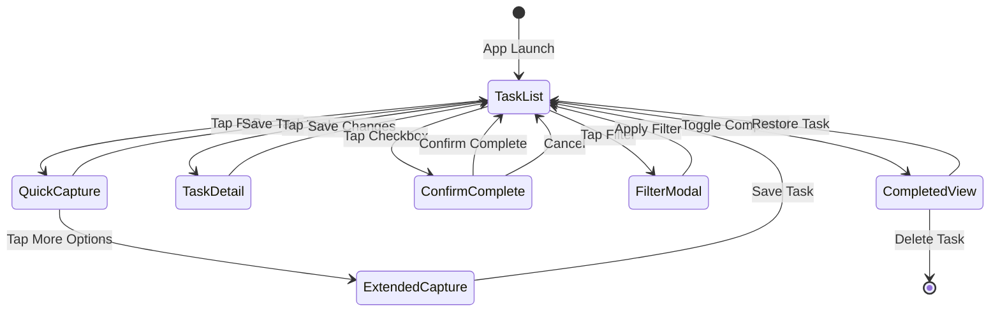

# User Flow: Create-Edit-Complete-Review

**Version**: 1.0  
**Date**: 2026-03-15  
**Status**: Final

## Overview

This document defines the complete user journey from task creation through completion and review. The flow is designed for minimal friction while supporting the full MVP feature set (M1-M8).

## Flow Diagram

```
┌─────────────┐
│   Launch    │
│   App       │
└──────┬──────┘
       │
       ▼
┌─────────────────────────────────────┐
│         Unified Task List            │
│  (View: ACTIVE tasks, grouped by     │
│   project, sorted by position)      │
└──────┬──────────────────────────────┘
       │
       ├─────────────────┬───────────────┬──────────────┐
       ▼                 ▼               ▼              ▼
  ┌─────────┐      ┌──────────┐   ┌──────────┐   ┌──────────┐
  │ Create  │      │  Edit    │   │ Complete │   │  Search  │
  │  Task   │      │  Task    │   │  Task    │   │  Filter  │
  └────┬────┘      └────┬─────┘   └────┬─────┘   └────┬─────┘
       │                │              │              │
       ▼                ▼              ▼              ▼
  ┌─────────┐      ┌──────────┐   ┌──────────┐   ┌──────────┐
 │ Quick   │      │  Task    │   │ Confirm  │   │  Apply   │
 │ Capture │      │  Detail  │   │ Complete │   │  Filter  │
 │ Modal   │      │  View    │   │  Modal   │   │  Modal   │
  └────┬────┘      └────┬─────┘   └────┬─────┘   └────┬─────┘
       │                │              │              │
       └────────────────┴──────────────┴──────────────┘
                         │
                         ▼
              ┌─────────────────────┐
              │   Task List Update  │
              │   (Auto-sort,       │
              │    persist to IDB)  │
              └─────────────────────┘
```

## Detailed Flow Steps

### 1. Initial State: Task List View

**Context**: User opens application

**Display**:
- Header with search bar and filter button
- Project sections (Work 💼, Personal 🏠, Household 🧹)
- Each section shows ACTIVE tasks sorted by position
- Floating Action Button (FAB) for quick task creation
- Empty state message if no tasks exist

**Data Loaded**:
```typescript
// Query all active tasks with project joins
tasks = await taskStore.query({
  status: 'ACTIVE',
  include: ['project', 'tags'],
  orderBy: ['position']
})
```

---

### 2. Create Task Flow

#### 2.1 Quick Capture (M1)

**Trigger**: Tap FAB button

**Action**: Open quick capture modal

**UI Elements**:
- Text input (auto-focus)
- Project selector (dropdown, default: last used project)
- Priority selector (optional: High/Medium/Low, default: Medium)
- "Add Task" button (enabled when title has content)
- "Cancel" button

**Validation Rules**:
```typescript
interface QuickTaskInput {
  title: string        // Required, min 1 char, max 200
  projectId: string    // Required, must reference existing project
  priority: 'HIGH' | 'MEDIUM' | 'LOW'  // Optional, default MEDIUM
}
```

**Backend Action**:
```typescript
const newTask = {
  id: generateUUID(),
  title: input.title,
  projectId: input.projectId,
  priority: input.priority,
  status: 'ACTIVE',
  position: await getNextPosition(input.projectId),
  createdAt: now,
  updatedAt: now
}
await taskStore.add(newTask)
```

**User Feedback**:
- Modal closes automatically
- New task appears at top of selected project section
- Subtle success toast: "Task added"

**Edge Cases**:
- Empty title: "Add Task" button disabled, inline error on blur
- Project deleted before submit: refresh project selector, show error
- Network offline: queue operation, show "Saved locally" indicator

---

#### 2.2 Extended Task Creation (Optional)

**Trigger**: Tap "More Options" in quick capture modal

**UI Elements** (additional to quick capture):
- Description textarea (multi-line)
- Tag selector (multi-select with autocomplete)
- Due date picker
- Reminder toggle + time selector

**Validation Rules**:
```typescript
interface ExtendedTaskInput extends QuickTaskInput {
  description?: string   // Optional, max 2000 chars
  tagIds?: string[]     // Optional, array of existing tag IDs
  dueDate?: Date        // Optional, must be future
  reminder?: {
    type: 'EMAIL' | 'PUSH' | 'SMS'
    triggerTime: Date   // Must be before dueDate if dueDate set
  }
}
```

**Backend Action**:
```typescript
const task = await taskStore.add(baseTask)
// Add tags via junction table
for (const tagId of input.tagIds) {
  await taskTagStore.add({ taskId: task.id, tagId })
}
// Add reminder if specified
if (input.reminder) {
  await reminderStore.add({
    id: generateUUID(),
    taskId: task.id,
    ...input.reminder,
    status: 'PENDING',
    createdAt: now
  })
}
```

---

### 3. Edit Task Flow (M5)

#### 3.1 Open Task Details

**Trigger**: Tap on any task card

**Action**: Open task detail view (modal or slide-over panel)

**UI Elements**:
- Title (editable)
- Project selector
- Description (editable textarea)
- Priority selector
- Tag selector (multi-select with option to create new tags)
- Due date picker
- Reminder settings
- Delete button (bottom, red)

**Data Loaded**:
```typescript
const task = await taskStore.get(taskId)
const project = await projectStore.get(task.projectId)
const tags = await taskTagStore.getByTaskId(taskId)
const reminders = await reminderStore.getByTaskId(taskId)
```

---

#### 3.2 Save Task Changes

**Trigger**: Tap "Save" or auto-save on field change (debounced 500ms)

**Validation Rules**:
```typescript
interface TaskUpdate {
  title?: string       // Min 1 char, max 200 if changed
  projectId?: string   // Must reference existing project
  description?: string // Max 2000 chars
  priority?: 'HIGH' | 'MEDIUM' | 'LOW'
  dueDate?: Date
}
```

**Backend Action**:
```typescript
await taskStore.update(taskId, {
  ...changes,
  updatedAt: now
})
// Update tags if changed
await taskTagStore.syncTaskTags(taskId, newTagIds)
// Update reminder if changed
await reminderStore.syncTaskReminder(taskId, newReminder)
```

**User Feedback**:
- "Saving..." indicator (brief)
- "Saved" checkmark (2 seconds)
- Task list updates in real-time

---

### 4. Complete Task Flow (M6)

#### 4.1 Mark Complete

**Trigger**: Tap checkbox on task card OR swipe right on task

**Action**: Show confirmation modal (can be disabled in settings)

**UI Elements** (Confirmation Modal):
- Task title
- "Mark as complete?"
- "Complete" button (primary)
- "Cancel" button

**Backend Action**:
```typescript
await taskStore.update(taskId, {
  status: 'COMPLETED',
  completedAt: now,
  updatedAt: now
})
```

**User Feedback**:
- Task card slides away with animation
- Confetti celebration (optional, can be disabled)
- Task moves to "Completed" section (if visible)
- Success toast: "Task completed! 🎉"

---

#### 4.2 Undo Completion

**Trigger**: Tap "Undo" in toast (5-second window)

**Action**: Revert task to ACTIVE status

**Backend Action**:
```typescript
await taskStore.update(taskId, {
  status: 'ACTIVE',
  completedAt: null,
  updatedAt: now
})
```

**User Feedback**:
- Task reappears in its original position
- "Task restored" toast

---

### 5. Search & Filter Flow (M7)

#### 5.1 Open Filter Modal

**Trigger**: Tap filter icon in header

**UI Elements**:
- Search text input
- Project filter (multi-select checkboxes)
- Priority filter (checkboxes: High, Medium, Low)
- Tag filter (multi-select)
- Due date filter (Overdue, Today, This Week, No Date)
- "Clear All" button
- "Apply" button

**State Representation**:
```typescript
interface TaskFilter {
  searchText?: string
  projectIds?: string[]
  priorities?: ('HIGH' | 'MEDIUM' | 'LOW')[]
  tagIds?: string[]
  dueDateFilter?: 'OVERDUE' | 'TODAY' | 'THIS_WEEK' | 'NONE'
}
```

---

#### 5.2 Apply Filter

**Trigger**: Tap "Apply"

**Action**: Execute filtered query

**Backend Action**:
```typescript
const tasks = await taskStore.query({
  status: 'ACTIVE',
  ...(filter.searchText && {
    where: { title: { contains: filter.searchText } }
  }),
  ...(filter.projectIds && {
    where: { projectId: { in: filter.projectIds } }
  }),
  ...(filter.priorities && {
    where: { priority: { in: filter.priorities } }
  }),
  orderBy: ['position']
})
// Tag filtering done in-memory for MVP
// (can be moved to DB query with composite index)
```

**User Feedback**:
- Loading spinner during query
- Results count displayed: "12 tasks found"
- Empty state if no results: "No tasks match your filter"

---

### 6. Review Completed Tasks

#### 6.1 View Completed Section

**Trigger**: Toggle "Show Completed" switch (or tap "Completed" tab)

**UI Elements**:
- Completed tasks grouped by completion date (Today, Yesterday, This Week, Older)
- Each task shows completedAt timestamp
- Swipe left to delete permanently
- Tap to restore to ACTIVE

**Data Loaded**:
```typescript
const completedTasks = await taskStore.query({
  status: 'COMPLETED',
  orderBy: ['-completedAt']
})
```

---

#### 6.2 Delete Task (Permanent)

**Trigger**: Swipe left on completed task OR tap delete in detail view

**Action**: Show confirmation modal

**Backend Action**:
```typescript
// Cascade delete related records
await taskTagStore.deleteByTaskId(taskId)
await reminderStore.deleteByTaskId(taskId)
await taskStore.delete(taskId)
```

**User Feedback**:
- Task removed with slide animation
- "Task deleted" toast
- No undo available for permanent delete

---

## State Transitions



## Error Handling

| Error Scenario | User Message | Recovery Action |
|----------------|--------------|-----------------|
| Title empty | "Please enter a task title" | Focus title input |
| Project not found | "Selected project no longer exists" | Refresh project list, prompt reselection |
| Save failed (offline) | "Saved locally. Will sync when online." | Queue operation, show sync icon |
| Tag creation failed | "Could not create tag. Try again." | Retry or skip tag |
| Due date invalid | "Due date must be in the future" | Reset to today or clear |
| Reminder after due date | "Reminder must be before due date" | Adjust reminder time |

## Performance Considerations

1. **Lazy Loading**: Load tasks on scroll (virtual list)
2. **Index Usage**: Ensure `status`, `projectId`, `position` indexes exist
3. **Debounced Search**: 300ms delay before executing search query
4. **Optimistic UI**: Update UI immediately, rollback on error
5. **Cache First**: Cache project/tag lists, refresh in background

## Accessibility

- **Keyboard Navigation**: Full tab and arrow key support
- **Screen Reader**: ARIA labels on all interactive elements
- **Touch Targets**: Minimum 44x44px for all tappable elements
- **Color Contrast**: WCAG AA compliance (4.5:1 ratio)
- **Focus Management**: Auto-focus on modal open, trap focus within modal

## Analytics Events

```typescript
// Track key user actions
analytics.track('task_created', { projectId, hasDescription, hasTags })
analytics.track('task_completed', { taskId, timeFromCreation })
analytics.track('task_edited', { fieldsChanged })
analytics.track('filter_applied', { filterType, resultCount })
analytics.track('task_deleted', { wasCompleted })
```

## Future Extensions

### v1.1-1.2
- **Bulk Actions**: Select multiple tasks for batch complete/delete
- **Task Duplication**: Copy task with all attributes
- **Subtasks**: Create-Edit-Complete flow extended to child tasks
- **Recurring Tasks**: Auto-create next instance on completion

### v2.0+
- **Collaboration**: Assign tasks to team members
- **Comments**: Review/discuss completed tasks
- **Time Tracking**: Log time spent per task
- **Dependencies**: Block completion of dependent tasks

---

## Appendix: Component Mapping

| Flow Step | Component | Domain Entity |
|-----------|-----------|---------------|
| Task List View | `TaskListView` | Task, Project |
| Quick Capture | `QuickCaptureModal` | Task |
| Extended Capture | `TaskDetailModal` | Task, Tag, Reminder |
| Filter | `FilterModal` | TaskFilter |
| Completed View | `CompletedTasksView` | Task |
| Confirm Complete | `ConfirmCompleteModal` | Task (status transition) |

---

**Document Status**: Complete - Ready for implementation in p7-ui-component-design
