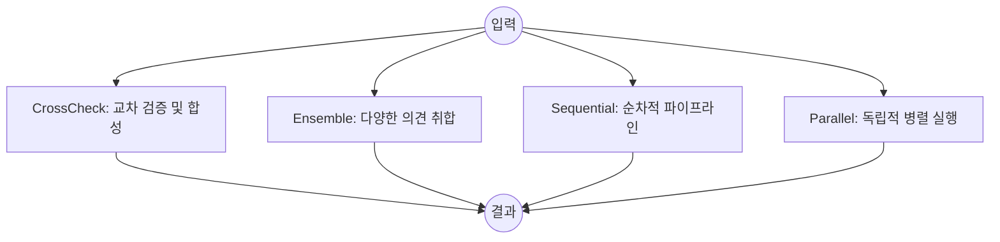

# Obora 멀티 에이전트 오케스트레이션 패턴 (Multi-agent Orchestration Patterns)

Obora는 여러 AI 에이전트를 조합하고 제어하기 위한 4가지 핵심 오케스트레이션 패턴을 제공합니다. 각 패턴은 복잡한 문제를 해결하기 위한 서로 다른 접근 방식을 제공하며, 정밀도, 속도, 비용 사이의 최적의 균형을 찾을 수 있도록 설계되었습니다.

## 전체 개요 (Overview)



---

## 1. CrossCheckPattern (교차 검증 패턴)

여러 에이전트가 병렬로 답변을 생성하고, '판사(Judge)' 에이전트가 이를 평가하여 최종 답변을 합성합니다.

### 워크플로우 (ASCII)
```text
[Input]
   │
   ├─▶ [Agent A] ──┐
   ├─▶ [Agent B] ──┼─▶ [Judge Agent] ──▶ [Final Answer]
   └─▶ [Agent C] ──┘      (평가 및 합성)
```

### 언제 사용하나요?
- 답변의 정확성이 매우 중요할 때
- 여러 모델의 의견을 종합하여 편향되지 않은 결론을 내리고 싶을 때
- 에이전트 간의 합의 수준(Agreement score)을 확인하고 싶을 때

### 주요 설정 옵션
- `agents`: 답변을 생성할 에이전트 목록
- `judge`: 답변을 평가하고 합성할 에이전트
- `judgePromptTemplate`: 판사 에이전트의 프롬프트 템플릿 (커스텀 가능)

### 예제 코드
```typescript
import { createCrossCheckPattern } from '@obora/core';

const pattern = createCrossCheckPattern({
  agents: [claude, openai, gemini],
  judge: claude,
  judgePromptTemplate: '당신은 기술 전문가입니다. 아래 답변들을 분석하여 최적의 아키텍처를 제안하세요.'
});

const result = await pattern.run(ctx, { 
  prompt: '고가용성 웹 서비스 구축을 위한 최적의 AWS 구성은?' 
}).result();

console.log(result.finalAnswer); // 합성된 최종 답변
console.log(result.agreement);   // 에이전트 간 합의도 (0.0 ~ 1.0)
```

### 결과 타입
- `finalAnswer`: 판사 에이전트가 합성한 최종 결과
- `agentResponses`: 각 에이전트의 개별 답변 및 소요 시간
- `agreement`: 답변 간 유사도 점수
- `totalDurationMs`: 전체 실행 시간

---

## 2. EnsemblePattern (앙상블 패턴)

여러 에이전트가 병렬로 실행되며, 미리 정의된 전략에 따라 하나의 답변을 선택하거나 결합합니다.

### 워크플로우 (ASCII)
```text
[Input]
   │
   ├─▶ [Agent A] ──┐
   ├─▶ [Agent B] ──┼─▶ [Aggregation Strategy] ──▶ [Final Answer]
   └─▶ [Agent C] ──┘    (선택 또는 결합)
```

### 언제 사용하나요?
- 가장 길거나 상세한 답변을 선택하고 싶을 때 (`longest`)
- 가장 먼저 도착한 답변을 사용하고 싶을 때 (`first`)
- 모든 답변을 단순히 연결하여 보고 싶을 때 (`concat`)

### 주요 설정 옵션
- `agents`: 실행할 에이전트 목록
- `aggregation`: 집계 전략 (`first` | `longest` | `shortest` | `concat` | `custom`)
- `customAggregator`: 사용자 정의 집계 함수

### 예제 코드
```typescript
const pattern = createEnsemblePattern({
  agents: [claude, openai],
  aggregation: 'longest', // 가장 긴 답변 선택
});

const result = await pattern.run(ctx, { prompt: '이 코드의 잠재적인 버그를 찾아주세요.' }).result();
```

### 결과 타입
- `finalAnswer`: 선택되거나 집계된 답변
- `aggregationStrategy`: 사용된 전략
- `agentResponses`: 모든 에이전트의 응답 결과

---

## 3. SequentialPattern (순차 패턴)

에이전트들이 사슬(Chain)처럼 연결되어 순차적으로 작업을 수행합니다. 이전 에이전트의 출력이 다음 에이전트의 입력으로 전달됩니다.

### 워크플로우 (ASCII)
```text
[Input] ──▶ [Agent A] ──▶ [Agent B] ──▶ [Agent C] ──▶ [Final Answer]
           (분석)        (리뷰)        (요약)
```

### 언제 사용하나요?
- 작업을 단계별로 나누어 처리해야 할 때 (예: 기획 -> 초안 작성 -> 검수)
- 이전 단계의 결과물이 다음 단계의 필수 컨텍스트일 때

### 주요 설정 옵션
- `agents`: 순서대로 실행될 에이전트 목록
- `passContext`: 이전 출력을 다음 에이전트에게 전달할지 여부 (기본값: `true`)

### 예제 코드
```typescript
const pattern = createSequentialPattern({
  agents: [analyzer, reviewer, summarizer],
  passContext: true,
});

const result = await pattern.run(ctx, { prompt: '신규 비즈니스 아이디어 제안' }).result();
```

### 결과 타입
- `finalAnswer`: 마지막 에이전트의 출력물
- `steps`: 각 단계별 입력, 출력 및 소요 시간

---

## 4. ParallelPattern (병렬 패턴)

여러 에이전트가 서로 간섭 없이 독립적으로 작업을 수행합니다. 모든 응답을 수집하지만 별도의 합성을 수행하지 않습니다.

### 워크플로우 (ASCII)
```text
[Input]
   │
   ├─▶ [Security Scanner] ──▶ [Result A]
   ├─▶ [Perf Analyzer]    ──▶ [Result B]
   └─▶ [Code Reviewer]    ──▶ [Result C]
```

### 언제 사용하나요?
- 독립적인 여러 분석 결과가 동시에 필요할 때
- 에이전트 중 일부가 실패하더라도 다른 결과를 확보해야 할 때 (Graceful failure)

### 주요 설정 옵션
- `agents`: 독립적으로 실행될 에이전트 목록

### 예제 코드
```typescript
const pattern = createParallelPattern({
  agents: [securityScanner, perfAnalyzer, codeReviewer],
});

const result = await pattern.run(ctx, { prompt: '이 소스 코드를 분석해줘.' }).result();
// result.responses에는 각 분석기의 독립적인 결과가 담깁니다.
```

### 결과 타입
- `responses`: 에이전트별 응답 목록 (성공 여부 및 에러 메시지 포함)
- `totalDurationMs`: 전체 실행 시간

---

## 패턴 비교 (Comparison Table)

| 특성 | CrossCheck | Ensemble | Sequential | Parallel |
| :--- | :--- | :--- | :--- | :--- |
| **실행 방식** | 병렬 + 합성 | 병렬 + 선택 | 순차적 | 독립 병렬 |
| **주요 장점** | 높은 신뢰도 | 중복성 및 다양성 | 단계별 정밀도 | 분석 다양성 및 안정성 |
| **합의 확인** | 가능 (Score) | 불가능 | 불가능 | 불가능 |
| **실행 시간** | 중간 (병렬 + 판사) | 빠름 (병렬) | 느림 (누적) | 빠름 (병렬) |
| **최종 답변** | 판사의 합성문 | 선택된 답변 | 마지막 에이전트 결과 | 각 에이전트 결과 목록 |

---

## 의사결정 가이드: 어떤 패턴을 선택해야 할까요?

1. **"가장 정확하고 검증된 답변이 필요한가요?"**
   - 👉 **CrossCheckPattern**을 선택하세요. 여러 AI의 의견을 대조하여 오류를 줄입니다.

2. **"여러 관점의 분석 결과가 각각 모두 필요한가요?"**
   - 👉 **ParallelPattern**을 선택하세요. 각 분야 전문 에이전트의 결과를 독립적으로 확인할 수 있습니다.

3. **"작업이 단계별(Pipeline)로 구성되어 있나요?"**
   - 👉 **SequentialPattern**을 선택하세요. 앞 단계의 결과물을 토대로 다음 단계를 수행합니다.

4. **"여러 모델 중 가장 뛰어난 답변 하나를 고르고 싶나요?"**
   - 👉 **EnsemblePattern**을 선택하세요. `longest` 전략 등을 통해 가장 품질이 좋은 응답을 취할 수 있습니다.

---

## 스트리밍 프로토콜 (Streaming Protocol)

각 패턴의 스트리밍 동작에 대한 명세입니다.

### 이벤트 순서 (Event Ordering)

| 패턴 | 순서 보장 | 설명 |
|------|----------|------|
| Sequential | `causal` | 인과관계 보장. 이벤트는 에이전트 순서대로 도착 |
| Parallel | `arrival` | 도착 순서. 어떤 에이전트의 이벤트가 먼저 올지 보장 없음 |
| Debate | `causal` | 인과관계 보장. 페이즈 순서대로 이벤트 도착 |
| Ensemble | `arrival` | 도착 순서. 병렬 실행으로 순서 보장 없음 |
| CrossCheck | `arrival` | 도착 순서. 에이전트 병렬 실행 후 판사 이벤트 |

### 취소 전파 (Cancellation Propagation)

| 패턴 | 전파 방식 | 설명 |
|------|----------|------|
| Sequential | `immediate` | 즉시 전파. 현재 에이전트 중단, 후속 에이전트 시작 안 함 |
| Parallel | `best-effort` | 최선 노력. 모든 에이전트에 취소 신호 전파, 즉각 중단 보장 없음 |
| Debate | `graceful` | 우아한 종료. 현재 페이즈 완료 후 취소 |
| Ensemble | `best-effort` | 최선 노력. 병렬 실행 중인 모든 에이전트에 전파 |
| CrossCheck | `graceful` | 우아한 종료. 판사 평가 전 취소 시 에이전트 결과까지 반환 |

### 에러 귀속 (Error Attribution)

에러 이벤트에는 다음 귀속 정보가 포함됩니다:

```typescript
interface ErrorAttribution {
  agentId?: string      // 에러 발생 에이전트 ID
  modelId?: string      // 사용된 모델 ID
  provider?: ProviderId // 프로바이더 (anthropic/openai/google)
  roundIndex?: number   // 라운드 인덱스 (해당시)
  phase?: string        // 현재 페이즈
}
```

### 사용 예시

```typescript
const handle = pattern.run(ctx, { prompt: 'Test' })

for await (const event of handle.events()) {
  if (event.type === 'error') {
    const { error, attribution } = event
    console.error(`Error in ${attribution?.agentId}: ${error}`)
  }
}
```

### 리플레이 지원 (Replay Support)

현재 모든 패턴은 `supportsReplay: false`입니다. 이벤트 리플레이는 향후 버전에서 지원될 예정입니다.
