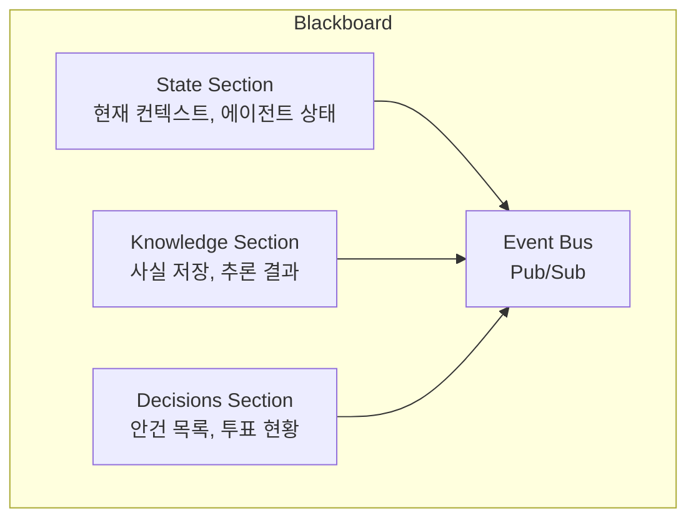
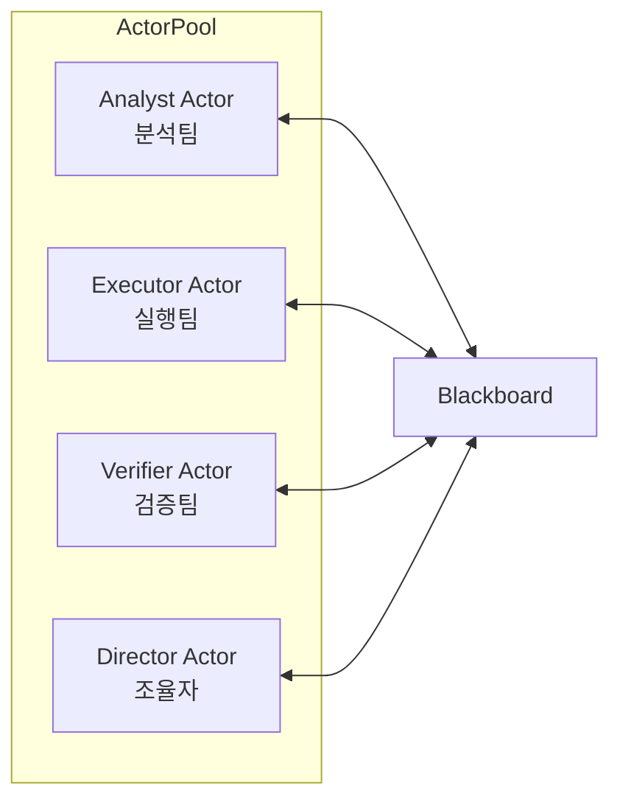
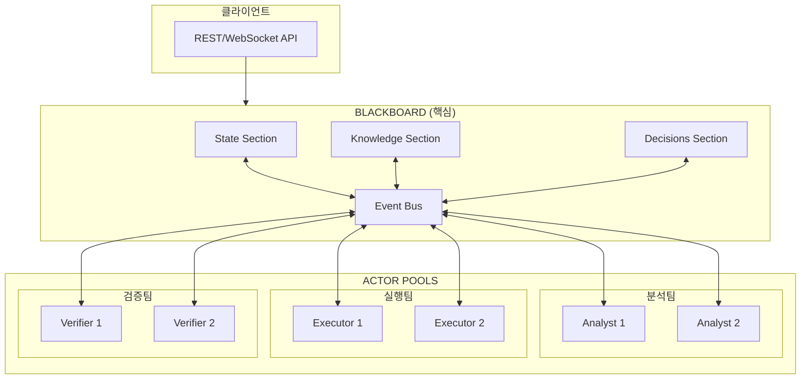
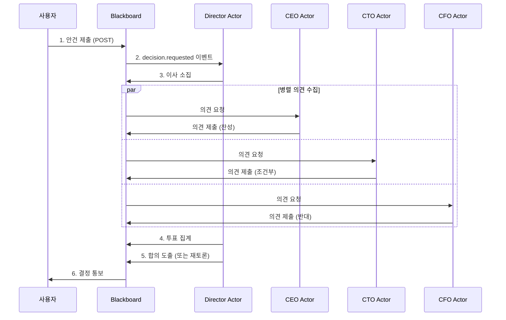
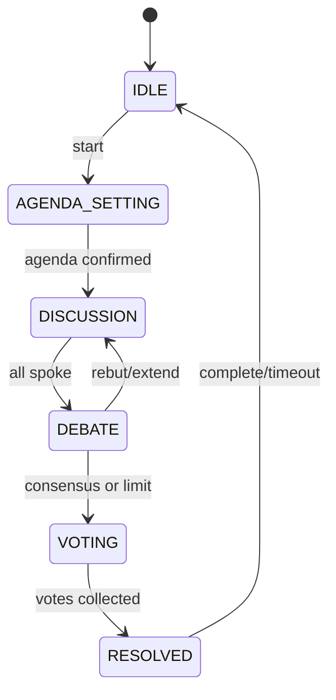

# Blackboard + Actor 아키텍처 설계

> **"Blackboard = 뇌, Actor = 손발"**
> 
> 공유 상태를 중심에 두고, 실행을 분산시켜라.
> 이것이 AI 에이전트 팀 협업의 자연스러운 구조다.

## 1. 개요

### 1.1 핵심 메타포

```
              ┌─────────────────────────────────┐
              │         BLACKBOARD (뇌)         │
              │  ┌───────────────────────────┐  │
              │  │ • 현재 상태 (State)        │  │
              │  │ • 의사결정 큐 (Decisions)  │  │
              │  │ • 지식 베이스 (Knowledge)  │  │
              │  │ • 합의 기록 (Consensus)    │  │
              │  └───────────────────────────┘  │
              └──────────────┬──────────────────┘
                             │
           ┌─────────────────┼─────────────────┐
           │                 │                 │
           ▼                 ▼                 ▼
    ┌──────────┐      ┌──────────┐      ┌──────────┐
    │ Actor A  │      │ Actor B  │      │ Actor C  │
    │ (분석)   │      │ (실행)   │      │ (검증)   │
    │   손     │      │   발     │      │   눈     │
    └──────────┘      └──────────┘      └──────────┘
```

- **Blackboard (뇌)**: 생각하고, 기억하고, 결정한다
- **Actor (손발)**: 지시를 받아 실행하고, 결과를 보고한다

### 1.2 왜 이 분리가 중요한가?

| 원칙 | 설명 |
|------|------|
| **뇌는 하나** | 합의와 상태는 중앙집중적이어야 일관성 유지 |
| **손발은 여럿** | 실행은 병렬화되어야 성능 확보 |
| **명확한 인터페이스** | 뇌↔손발 통신이 단순해짐 |

---

## 2. 핵심 컴포넌트

### 2.1 Blackboard (공유 상태)

Blackboard는 시스템의 **단일 진실 소스(SSOT)**입니다.



#### 주요 기능

| 기능 | 설명 |
|------|------|
| **State Management** | 현재 컨텍스트, 에이전트 상태, 실행 결과 관리 |
| **Knowledge Base** | 사실 저장, 추론 결과, 학습된 패턴 |
| **Decision Queue** | 안건 목록, 투표 현황, 최종 결정 |
| **Event Bus** | Pub/Sub 기반 변경 알림 |

#### 인터페이스

```typescript
interface Blackboard {
  // 현재 상태
  state: {
    context: Record<string, unknown>;
    agents: Map<AgentId, AgentStatus>;
    tasks: Map<TaskId, Task>;
  };
  
  // 지식 베이스
  knowledge: {
    facts: Fact[];
    inferences: Inference[];
    patterns: Pattern[];
  };
  
  // 의사결정
  decisions: {
    pending: Agenda[];
    inProgress: Map<AgendaId, VotingSession>;
    resolved: Resolution[];
  };
  
  // 이벤트 버스
  events: EventEmitter;
  
  // API
  read(section: string, query?: Query): unknown;
  write(section: string, data: unknown): void;
  subscribe(event: string, handler: Handler): Unsubscribe;
}
```

### 2.2 Actor Pool (병렬 실행)

Actor는 독립적인 실행 단위로, 각자의 역할에 따라 Blackboard와 상호작용합니다.



#### Actor 유형

| Actor 유형 | 역할 | 예시 |
|-----------|------|------|
| **Analyst** | 분석, 추론 | 데이터 분석, 위험 평가 |
| **Executor** | 실행, 행동 | API 호출, 파일 처리 |
| **Verifier** | 검증, 확인 | 결과 검증, 품질 체크 |
| **Director** | 조율, 진행 | 회의 진행, 투표 관리 |

#### 인터페이스

```typescript
interface Actor {
  id: ActorId;
  role: 'analyst' | 'executor' | 'verifier' | 'director';
  
  // Blackboard 연결
  board: Blackboard;
  
  // 행동 사이클
  observe(): Observation;      // 보드 읽기
  think(obs: Observation): Action;  // 판단
  act(action: Action): Result; // 실행
  report(result: Result): void; // 보드에 기록
}
```

### 2.3 Event Bus (선택적, 확장 시)

이벤트 버스는 Blackboard와 Actor 간의 비동기 통신을 담당합니다.

#### 주요 이벤트

| 이벤트 | 발행 시점 | 구독자 |
|--------|----------|--------|
| `state.updated` | 상태 변경 시 | 관련 Actor들 |
| `decision.requested` | 안건 제출 시 | Director, 이사 Actor들 |
| `task.assigned` | 작업 할당 시 | 해당 Actor |
| `vote.submitted` | 투표 제출 시 | Director |
| `consensus.reached` | 합의 도달 시 | 모든 Actor |

---

## 3. 아키텍처 다이어그램

### 3.1 전체 시스템 구조

```
┌─────────────────────────────────────────────────────────────────┐
│                    OBORA-KIT ARCHITECTURE                       │
│                    (Blackboard + Actor)                         │
└─────────────────────────────────────────────────────────────────┘

                         ┌─────────────────┐
                         │   Client API    │
                         │  (REST/WebSocket)│
                         └────────┬────────┘
                                  │
                                  ▼
┌─────────────────────────────────────────────────────────────────┐
│                        BLACKBOARD (핵심)                        │
│  ┌──────────────┐ ┌──────────────┐ ┌──────────────┐            │
│  │    State     │ │   Knowledge  │ │   Decisions  │            │
│  │   Section    │ │   Section    │ │   Section    │            │
│  │              │ │              │ │              │            │
│  │ • 현재 컨텍스트│ │ • 사실 저장   │ │ • 안건 목록   │            │
│  │ • 에이전트 상태│ │ • 추론 결과   │ │ • 투표 현황   │            │
│  │ • 실행 결과   │ │ • 학습된 패턴 │ │ • 최종 결정   │            │
│  └──────────────┘ └──────────────┘ └──────────────┘            │
│                                                                 │
│  ┌──────────────────────────────────────────────────────────┐  │
│  │                    Event Bus (Pub/Sub)                    │  │
│  │   • state.updated  • decision.requested  • task.assigned │  │
│  └──────────────────────────────────────────────────────────┘  │
└─────────────────────────────────────────────────────────────────┘
         │                    │                    │
         ▼                    ▼                    ▼
┌─────────────┐      ┌─────────────┐      ┌─────────────┐
│  Actor Pool │      │  Actor Pool │      │  Actor Pool │
│  (분석팀)    │      │  (실행팀)    │      │  (검증팀)   │
│             │      │             │      │             │
│ ┌─────────┐ │      │ ┌─────────┐ │      │ ┌─────────┐ │
│ │Analyst 1│ │      │ │Executor1│ │      │ │Verifier1│ │
│ └─────────┘ │      │ └─────────┘ │      │ └─────────┘ │
│ ┌─────────┐ │      │ ┌─────────┐ │      │ ┌─────────┐ │
│ │Analyst 2│ │      │ │Executor2│ │      │ │Verifier2│ │
│ └─────────┘ │      │ └─────────┘ │      │ └─────────┘ │
└─────────────┘      └─────────────┘      └─────────────┘
```

### 3.2 Mermaid 버전



---

## 4. AI 이사회 의사결정 흐름

### 4.1 전체 흐름



### 4.2 상세 흐름

```
┌────────────────────────────────────────────────────────────────┐
│                    AI 이사회 의사결정 흐름                       │
└────────────────────────────────────────────────────────────────┘

1️⃣ 안건 제출
   ┌──────────┐         ┌─────────────────────────┐
   │ 사용자    │ ──────▶ │ Blackboard.Decisions    │
   └──────────┘ POST    │ { agenda: "신규 투자 검토" }│
                        └─────────────────────────┘
                                   │
                                   ▼ event: decision.requested

2️⃣ 이사 소집
   ┌─────────────────────────────────────────────────────────┐
   │                    ACTOR POOL (이사회)                   │
   │  ┌─────────┐  ┌─────────┐  ┌─────────┐  ┌─────────┐   │
   │  │재무이사  │  │기술이사  │  │법무이사  │  │대표이사  │   │
   │  │(Claude)│  │(GPT-5) │  │(Gemini)│  │(조율자) │   │
   │  └────┬────┘  └────┬────┘  └────┬────┘  └────┬────┘   │
   └───────┼────────────┼────────────┼────────────┼────────┘
           │            │            │            │
           ▼            ▼            ▼            ▼

3️⃣ 분석 및 의견 제출 (병렬)
   ┌─────────────────────────────────────────────────────────┐
   │ Blackboard.Decisions[agenda-1].opinions                 │
   │                                                         │
   │  재무이사: { vote: "찬성", reason: "ROI 15% 예상" }      │
   │  기술이사: { vote: "조건부", reason: "기술실사 필요" }    │
   │  법무이사: { vote: "반대", reason: "규제 리스크" }       │
   └─────────────────────────────────────────────────────────┘
                                   │
                                   ▼ 모든 이사 의견 수렴 완료

4️⃣ 합의 도출
   ┌─────────────────────────────────────────────────────────┐
   │ Director Actor (조율자)                                  │
   │                                                         │
   │ 1. 의견 집계: 찬성 1, 조건부 1, 반대 1                   │
   │ 2. 반대 사유 검토: 규제 리스크 심각도 평가 요청          │
   │ 3. 조건 협상: 기술실사 일정 제안                         │
   │ 4. 재투표 또는 최종 결정                                 │
   └─────────────────────────────────────────────────────────┘
                                   │
                                   ▼

5️⃣ 결정 기록
   ┌─────────────────────────────────────────────────────────┐
   │ Blackboard.Decisions[agenda-1].resolution               │
   │                                                         │
   │ {                                                       │
   │   decision: "조건부 승인",                              │
   │   conditions: ["기술실사 완료", "규제 검토 보고서"],      │
   │   voteSummary: { for: 2, against: 1, abstain: 0 },     │
   │   timestamp: "2026-02-04T19:00:00Z"                    │
   │ }                                                       │
   └─────────────────────────────────────────────────────────┘
```

### 4.3 상태 전이 다이어그램



---

## 5. 데이터 구조

### 5.1 Blackboard 상태 스키마

```typescript
// 전체 Blackboard 스키마
interface BlackboardState {
  // 메타데이터
  meta: {
    version: number;
    lastUpdated: Date;
    sessionId: string;
  };
  
  // 현재 상태
  state: {
    phase: 'idle' | 'discussion' | 'debate' | 'voting' | 'resolved';
    context: Record<string, unknown>;
    agents: Map<AgentId, AgentStatus>;
  };
  
  // 지식 베이스
  knowledge: {
    facts: Array<{
      id: string;
      content: string;
      source: AgentId;
      confidence: number;
      timestamp: Date;
    }>;
    inferences: Array<{
      id: string;
      conclusion: string;
      premises: string[];
      derivedBy: AgentId;
    }>;
  };
  
  // 의사결정
  decisions: {
    current: Agenda | null;
    opinions: Map<AgentId, Opinion>;
    votes: Map<AgentId, Vote>;
    history: Resolution[];
  };
}

// 안건
interface Agenda {
  id: string;
  title: string;
  description: string;
  proposer: AgentId;
  deadline?: Date;
  requiredQuorum: number;
  votingMethod: 'majority' | 'unanimous' | 'weighted';
}

// 의견
interface Opinion {
  agentId: AgentId;
  stance: 'approve' | 'reject' | 'conditional' | 'abstain';
  reason: string;
  conditions?: string[];
  confidence: number;
  timestamp: Date;
}

// 결정
interface Resolution {
  agendaId: string;
  decision: 'approved' | 'rejected' | 'deferred';
  summary: string;
  voteSummary: {
    approve: number;
    reject: number;
    abstain: number;
  };
  conditions?: string[];
  dissent?: string[];
  timestamp: Date;
}
```

### 5.2 Actor 메시지 타입

```typescript
// 메시지 기본 타입
interface Message<T = unknown> {
  id: string;
  type: MessageType;
  from: ActorId;
  to: ActorId | 'broadcast';
  payload: T;
  correlationId?: string;
  timestamp: Date;
}

// 메시지 타입 enum
enum MessageType {
  // 상태 관련
  STATE_READ = 'state.read',
  STATE_WRITE = 'state.write',
  STATE_SUBSCRIBE = 'state.subscribe',
  
  // 의사결정 관련
  DECISION_REQUEST = 'decision.request',
  OPINION_SUBMIT = 'opinion.submit',
  VOTE_SUBMIT = 'vote.submit',
  CONSENSUS_REACHED = 'consensus.reached',
  
  // 작업 관련
  TASK_ASSIGN = 'task.assign',
  TASK_COMPLETE = 'task.complete',
  TASK_FAILED = 'task.failed',
  
  // 시스템 관련
  HEARTBEAT = 'heartbeat',
  ERROR = 'error',
}
```

---

## 6. 구현 로드맵

### 6.1 Phase 1: Foundation (Week 1-2)

```
Week 1-2: Blackboard Core
━━━━━━━━━━━━━━━━━━━━━━━━━━━━━━━━━━━━━━━━━━━━━━━━

목표: Blackboard의 핵심 기능 구현

┌─────────────────────────────────────────────────┐
│ 1. 상태 관리                                    │
│    • State section CRUD                        │
│    • 버전 관리 (optimistic locking)             │
│    • 스냅샷 / 복원                              │
│                                                 │
│ 2. 이벤트 버스                                  │
│    • Pub/Sub 구현 (EventEmitter 기반)          │
│    • 이벤트 필터링                              │
│    • 재생(replay) 기능                          │
│                                                 │
│ 3. 영속성                                       │
│    • 인메모리 (기본)                            │
│    • SQLite (옵션)                             │
│    • Redis (옵션)                              │
└─────────────────────────────────────────────────┘

산출물:
• @obora-kit/blackboard 패키지
• 단위 테스트 커버리지 80%+
• API 문서
```

### 6.2 Phase 2: Actor System (Week 3-4)

```
Week 3-4: Actor Runtime
━━━━━━━━━━━━━━━━━━━━━━━━━━━━━━━━━━━━━━━━━━━━━━━━

목표: Actor 실행 환경 구현

┌─────────────────────────────────────────────────┐
│ 1. Actor 기본                                   │
│    • Actor 정의 / 등록                          │
│    • 생명주기 관리 (spawn, stop, restart)       │
│    • Blackboard 연결                           │
│                                                 │
│ 2. Actor Pool                                  │
│    • 풀 관리 (확장, 축소)                       │
│    • 작업 분배                                  │
│    • 로드 밸런싱                                │
│                                                 │
│ 3. 에러 처리                                    │
│    • Supervision (재시작 전략)                  │
│    • Dead letter queue                         │
│    • 회로 차단기 (Circuit breaker)              │
└─────────────────────────────────────────────────┘

산출물:
• @obora-kit/actor 패키지
• 통합 테스트
• 예제: 간단한 에이전트 팀
```

### 6.3 Phase 3: AI Integration (Week 5-6)

```
Week 5-6: AI 에이전트 통합
━━━━━━━━━━━━━━━━━━━━━━━━━━━━━━━━━━━━━━━━━━━━━━━━

목표: LLM 기반 Actor 구현

┌─────────────────────────────────────────────────┐
│ 1. LLM Actor                                   │
│    • OpenAI / Anthropic / Gemini 어댑터         │
│    • 프롬프트 템플릿                            │
│    • 응답 파싱 / 검증                           │
│                                                 │
│ 2. 에이전트 역할                                │
│    • Analyst (분석)                            │
│    • Executor (실행)                           │
│    • Verifier (검증)                           │
│    • Director (조율)                           │
│                                                 │
│ 3. 도구 통합                                    │
│    • Function calling                          │
│    • MCP 프로토콜                               │
│    • 도구 레지스트리                            │
└─────────────────────────────────────────────────┘

산출물:
• @obora-kit/agents 패키지
• 다중 LLM 테스트
• 예제: AI 분석 팀
```

### 6.4 Phase 4: Board System (Week 7-8)

```
Week 7-8: 이사회 시스템
━━━━━━━━━━━━━━━━━━━━━━━━━━━━━━━━━━━━━━━━━━━━━━━━

목표: AI 이사회 의사결정 구현

┌─────────────────────────────────────────────────┐
│ 1. 안건 관리                                    │
│    • 안건 제출 / 철회                           │
│    • 우선순위 / 마감                            │
│    • 상태 전이                                  │
│                                                 │
│ 2. 투표 시스템                                  │
│    • 투표 유형 (다수결, 만장일치, 가중치)        │
│    • 의견 제출 / 수정                           │
│    • 합의 알고리즘                              │
│                                                 │
│ 3. 조율 메커니즘                                │
│    • 반대 의견 중재                             │
│    • 조건부 합의                                │
│    • 에스컬레이션                               │
└─────────────────────────────────────────────────┘

산출물:
• @obora-kit/board 패키지
• E2E 테스트
• 데모: AI 이사회 시뮬레이션
```

### 6.5 Timeline Summary

```
Week    1    2    3    4    5    6    7    8
        ├────┴────┼────┴────┼────┴────┼────┴────┤
Phase   │ Blackboard │  Actor   │    AI    │  Board  │
        │   Core     │  System  │Integration│ System  │
        └───────────────────────────────────────────┘
                              │
                              ▼
                         MVP Release
                        (8주 = 2개월)
```

---

## 7. 기술 스택

### 7.1 필수 기술

| 영역 | 기술 | 선택 이유 |
|------|------|----------|
| **언어** | TypeScript | 타입 안전성, 에코시스템 |
| **런타임** | Node.js 20+ | 비동기 처리, 생태계 |
| **이벤트** | EventEmitter | 내장, 검증됨 |
| **저장소** | In-memory (기본) | 초기 단순화 |

### 7.2 선택적 기술

| 영역 | 기술 | 적용 시점 |
|------|------|----------|
| **상태 기계** | xstate | Phase 4 (복잡한 흐름 제어 시) |
| **분산 저장소** | Redis | 확장 시 |
| **메시지 큐** | NATS / BullMQ | 분산 Actor 시 |
| **모니터링** | OpenTelemetry | 프로덕션 |

### 7.3 패키지 구조

```
packages/
├── blackboard/           # 핵심 Blackboard
│   ├── src/
│   │   ├── core/        # 상태 관리
│   │   ├── events/      # 이벤트 버스
│   │   └── storage/     # 저장소 어댑터
│   └── package.json
│
├── actor/               # Actor 시스템
│   ├── src/
│   │   ├── runtime/     # Actor 런타임
│   │   ├── pool/        # Actor 풀 관리
│   │   └── supervision/ # 에러 처리
│   └── package.json
│
├── agents/              # AI 에이전트
│   ├── src/
│   │   ├── llm/         # LLM 어댑터
│   │   ├── roles/       # 역할별 에이전트
│   │   └── tools/       # 도구 통합
│   └── package.json
│
└── board/               # 이사회 시스템
    ├── src/
    │   ├── agenda/      # 안건 관리
    │   ├── voting/      # 투표 시스템
    │   └── consensus/   # 합의 알고리즘
    └── package.json
```

---

## 8. 참고 문서

- [ADR-001: Blackboard + Actor 아키텍처 선택](./decisions/ADR-001-blackboard-actor-architecture.md)
- [아키텍처 토론 요약](./decisions/architecture-debate-summary.md)
- [obora-kit README](../README.md)

---

*문서 작성일: 2026-02-04*
*버전: 1.0.0*
