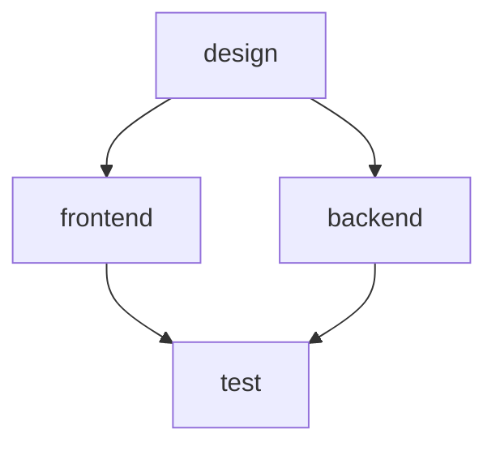

# Dependency Resolver Specification

> 버전: v3
> 패키지: @obora/core (dependency-resolver)

---

## 개요

의존성 해석기(Dependency Resolver)는 워크플로우 단계 간의 의존성을 분석하고 실행 순서를 결정합니다.

### 역할

- 순환 의존성 감지
- 실행 순서 계산 (토폴로지 정렬)
- 병렬 실행 가능 그룹 식별

### 관련 원칙

| 원칙 | 적용 |
|------|------|
| **Scalable** | 병렬 실행으로 성능 향상 |
| **Fluid** | 의존성 기반 유연한 실행 순서 |

---

## 알고리즘

### 전체 흐름

```
입력: 워크플로우 steps
    ↓
1. 의존성 그래프 구축
    ↓
2. DFS 순환 감지 (전처리)
    ↓ (순환 없음)
3. Kahn's Algorithm (토폴로지 정렬)
    ↓
4. 병렬 레벨 결정
    ↓
출력: ExecutionPlan
```

---

## Kahn's Algorithm 상세

### 알고리즘 개요

Kahn's Algorithm은 BFS 기반 토폴로지 정렬 알고리즘입니다.

**핵심 아이디어:**
1. 진입 차수(indegree)가 0인 노드를 큐에 추가
2. 큐에서 노드를 꺼내 결과에 추가
3. 해당 노드의 모든 인접 노드의 진입 차수 감소
4. 진입 차수가 0이 된 노드를 큐에 추가
5. 큐가 빌 때까지 반복

### 의사 코드

```
function kahnTopologicalSort(graph):
    indegree = calculateIndegree(graph)
    queue = nodes where indegree[node] == 0
    result = []
    
    while queue is not empty:
        node = queue.dequeue()
        result.append(node)
        
        for neighbor in graph[node]:
            indegree[neighbor] -= 1
            if indegree[neighbor] == 0:
                queue.enqueue(neighbor)
    
    if result.length != graph.nodeCount:
        throw CyclicDependencyError
    
    return result
```

### TypeScript 구현

```typescript
interface Step {
  name: string;
  depends_on?: string[];
  inputs?: string[];
  outputs?: string[];
}

interface Graph {
  nodes: Set<string>;
  edges: Map<string, Set<string>>;  // from -> [to] (의존 대상 → 의존하는 노드)
}

function kahnSort(steps: Step[]): string[] {
  const graph = buildGraph(steps);
  const indegree = new Map<string, number>();
  
  // 진입 차수 초기화 (모든 노드를 0으로)
  for (const node of graph.nodes) {
    indegree.set(node, 0);
  }
  
  // 진입 차수 계산 (inputs/outputs 기반 암묵적 의존성 포함)
  for (const step of steps) {
    let inDegreeCount = 0;
    
    // 1. 명시적 의존성 (depends_on)
    inDegreeCount += (step.depends_on?.length || 0);
    
    // 2. 암묵적 의존성 (inputs가 다른 step의 outputs에 있는 경우)
    for (const otherStep of steps) {
      if (otherStep.name === step.name) continue;
      if (otherStep.outputs?.some(out => step.inputs?.includes(out))) {
        inDegreeCount++;
      }
    }
    
    indegree.set(step.name, inDegreeCount);
  }
  
  // indegree=0인 노드로 큐 초기화
  const queue: string[] = [];
  for (const [node, degree] of indegree) {
    if (degree === 0) {
      queue.push(node);
    }
  }
  
  // BFS
  const result: string[] = [];
  while (queue.length > 0) {
    const node = queue.shift()!;
    result.push(node);
    
    const neighbors = graph.edges.get(node) || new Set();
    for (const neighbor of neighbors) {
      const newDegree = (indegree.get(neighbor) || 1) - 1;
      indegree.set(neighbor, newDegree);
      
      if (newDegree === 0) {
        queue.push(neighbor);
      }
    }
  }
  
  // 순환 감지
  if (result.length !== graph.nodes.size) {
    throw new CyclicDependencyError('Circular dependency detected');
  }
  
  return result;
}

/**
 * 의존성 그래프 빌드
 * edges: 의존 대상 → 의존하는 노드들
 * 예: A가 B에 의존하면 edges['B'].add('A')
 */
function buildGraph(steps: Step[]): Graph {
  const nodes = new Set(steps.map(s => s.name));
  const edges = new Map<string, Set<string>>();
  
  // 초기화
  for (const node of nodes) {
    edges.set(node, new Set());
  }
  
  for (const step of steps) {
    // 명시적 의존성
    for (const dep of step.depends_on || []) {
      edges.get(dep)?.add(step.name);
    }
    
    // 암묵적 의존성 (inputs/outputs)
    for (const otherStep of steps) {
      if (otherStep.name === step.name) continue;
      if (otherStep.outputs?.some(out => step.inputs?.includes(out))) {
        edges.get(otherStep.name)?.add(step.name);
      }
    }
  }
  
  return { nodes, edges };
}
```

---

## DFS 순환 감지

### 알고리즘 개요

깊이 우선 탐색(DFS)으로 순환 의존성을 감지합니다.

**핵심 아이디어:**
1. 각 노드를 WHITE(미방문), GRAY(방문 중), BLACK(완료)로 표시
2. DFS 중 GRAY 노드를 만나면 순환 발견
3. 순환 경로를 추적하여 에러 메시지에 포함

### 의사 코드

```
function detectCycles(graph):
    color = {}  // WHITE, GRAY, BLACK
    parent = {}
    
    for node in graph.nodes:
        color[node] = WHITE
    
    for node in graph.nodes:
        if color[node] == WHITE:
            if dfs(node, color, parent):
                return constructCyclePath(parent)
    
    return null  // 순환 없음

function dfs(node, color, parent):
    color[node] = GRAY
    
    for neighbor in graph[node]:
        if color[neighbor] == GRAY:
            parent[neighbor] = node
            return true  // 순환 발견
        if color[neighbor] == WHITE:
            parent[neighbor] = node
            if dfs(neighbor, color, parent):
                return true
    
    color[node] = BLACK
    return false
```

### TypeScript 구현

```typescript
enum Color {
  WHITE = 'white',  // 미방문
  GRAY = 'gray',    // 방문 중 (스택에 있음)
  BLACK = 'black',  // 완료
}

interface CycleResult {
  hasCycle: boolean;
  cyclePath?: string[];
}

function detectCycles(graph: Graph): CycleResult {
  const color = new Map<string, Color>();
  const parent = new Map<string, string>();
  
  // 초기화
  for (const node of graph.nodes) {
    color.set(node, Color.WHITE);
  }
  
  // 모든 노드에서 DFS 시작
  for (const node of graph.nodes) {
    if (color.get(node) === Color.WHITE) {
      const result = dfs(node, graph, color, parent);
      if (result.hasCycle) {
        return result;
      }
    }
  }
  
  return { hasCycle: false };
}

function dfs(
  node: string,
  graph: Graph,
  color: Map<string, Color>,
  parent: Map<string, string>
): CycleResult {
  color.set(node, Color.GRAY);
  
  const neighbors = graph.edges.get(node) || new Set();
  for (const neighbor of neighbors) {
    if (color.get(neighbor) === Color.GRAY) {
      // 순환 발견 - 경로 구성
      const cyclePath = constructCyclePath(neighbor, node, parent);
      return { hasCycle: true, cyclePath };
    }
    
    if (color.get(neighbor) === Color.WHITE) {
      parent.set(neighbor, node);
      const result = dfs(neighbor, graph, color, parent);
      if (result.hasCycle) {
        return result;
      }
    }
  }
  
  color.set(node, Color.BLACK);
  return { hasCycle: false };
}

function constructCyclePath(
  cycleStart: string,
  cycleEnd: string,
  parent: Map<string, string>
): string[] {
  const path: string[] = [cycleStart];
  let current = cycleEnd;
  
  while (current !== cycleStart) {
    path.unshift(current);
    current = parent.get(current)!;
  }
  
  path.push(cycleStart);  // 순환 완성
  return path;
}
```

---

## ExecutionLevel 인터페이스

### 타입 정의

```typescript
/**
 * 실행 계획 전체
 */
interface ExecutionPlan {
  /** 실행 레벨 목록 (순서대로 실행) */
  levels: ExecutionLevel[];
  
  /** 총 단계 수 */
  totalSteps: number;
  
  /** 예상 최대 병렬도 */
  maxParallelism: number;
}

/**
 * 동일 레벨의 실행 그룹
 */
interface ExecutionLevel {
  /** 레벨 번호 (0부터 시작) */
  level: number;
  
  /** 이 레벨에서 실행할 단계들 */
  steps: string[];
  
  /** 병렬 실행 가능 여부 */
  parallel: boolean;
  
  /** 예상 실행 시간 (옵션) */
  estimatedDuration?: number;
}

/**
 * 의존성 해석기 인터페이스
 */
interface DependencyResolver {
  /**
   * 워크플로우 단계들의 실행 계획 생성
   * @throws CyclicDependencyError 순환 의존성 발견 시
   */
  resolve(steps: Step[]): ExecutionPlan;
  
  /**
   * 순환 의존성만 검사
   */
  detectCycles(steps: Step[]): CycleResult;
  
  /**
   * 의존성 그래프 시각화 (디버깅용)
   */
  visualize(steps: Step[]): string;
}
```

### 사용 예시

```typescript
const resolver = new DependencyResolver();

const steps: Step[] = [
  { name: 'design', outputs: ['design.md'] },
  { name: 'frontend', depends_on: ['design'], outputs: ['frontend.md'] },
  { name: 'backend', depends_on: ['design'], outputs: ['backend.md'] },
  { name: 'test', depends_on: ['frontend', 'backend'] },
];

const plan = resolver.resolve(steps);

console.log(plan);
// {
//   levels: [
//     { level: 0, steps: ['design'], parallel: false },
//     { level: 1, steps: ['frontend', 'backend'], parallel: true },
//     { level: 2, steps: ['test'], parallel: false },
//   ],
//   totalSteps: 4,
//   maxParallelism: 2,
// }
```

---

## 병렬 실행 조건

### 병렬 가능 조건

같은 레벨의 단계들이 병렬 실행 가능하려면:

1. **의존성 없음**: 서로 의존하지 않음
2. **리소스 충돌 없음**: 동일 파일 쓰기 없음
3. **parallel 플래그**: `parallel: false`가 아님

### 병렬 결정 로직

```typescript
function determineParallel(
  steps: Step[],
  levelSteps: string[]
): boolean {
  // 단일 단계면 병렬 의미 없음
  if (levelSteps.length <= 1) {
    return false;
  }
  
  // 명시적으로 병렬 비활성화된 단계 확인
  const stepMap = new Map(steps.map(s => [s.name, s]));
  for (const stepName of levelSteps) {
    const step = stepMap.get(stepName);
    if (step?.parallel === false) {
      return false;
    }
  }
  
  // 출력 파일 충돌 확인
  const outputs = new Set<string>();
  for (const stepName of levelSteps) {
    const step = stepMap.get(stepName);
    for (const output of step?.outputs || []) {
      if (outputs.has(output)) {
        return false;  // 동일 파일 출력 충돌
      }
      outputs.add(output);
    }
  }
  
  return true;
}
```

### 예시: 병렬 실행 불가

```yaml
steps:
  - name: frontend
    outputs:
      - shared/config.json    # 충돌!
  - name: backend
    outputs:
      - shared/config.json    # 충돌!
```

위 경우 `frontend`와 `backend`가 동일 파일에 쓰기 때문에 순차 실행됩니다.

---

## 엣지 케이스

### 1. 빈 steps

```typescript
const plan = resolver.resolve([]);
// { levels: [], totalSteps: 0, maxParallelism: 0 }
```

### 2. 단일 step

```typescript
const plan = resolver.resolve([
  { name: 'only-step', agent: 'general' }
]);
// { levels: [{ level: 0, steps: ['only-step'], parallel: false }], ... }
```

### 3. 자기 자신 의존

```typescript
const steps = [
  { name: 'step-a', depends_on: ['step-a'] }  // 자기 참조
];
// ERROR: Circular dependency: step-a → step-a
```

### 4. 존재하지 않는 의존성

```typescript
const steps = [
  { name: 'step-a', depends_on: ['nonexistent'] }
];
// ERROR: Step 'step-a' depends on unknown step 'nonexistent'
```

### 5. 복잡한 순환

```typescript
const steps = [
  { name: 'a', depends_on: ['c'] },
  { name: 'b', depends_on: ['a'] },
  { name: 'c', depends_on: ['b'] },
];
// ERROR: Circular dependency: a → c → b → a
```

### 6. 다이아몬드 의존성

```typescript
const steps = [
  { name: 'root' },
  { name: 'left', depends_on: ['root'] },
  { name: 'right', depends_on: ['root'] },
  { name: 'merge', depends_on: ['left', 'right'] },
];
// 정상 처리:
// Level 0: [root]
// Level 1: [left, right] (parallel)
// Level 2: [merge]
```

### 7. 암묵적 의존성 (inputs/outputs)

```typescript
const steps = [
  { name: 'produce', outputs: ['data.json'] },
  { name: 'consume', inputs: ['data.json'] },  // 암묵적 의존
];
// produce → consume 의존성 자동 추론
```

---

## 에러 처리

### 에러 타입

```typescript
/**
 * 순환 의존성 에러
 */
class CyclicDependencyError extends Error {
  readonly cyclePath: string[];
  
  constructor(cyclePath: string[]) {
    const pathStr = cyclePath.join(' → ');
    super(`Circular dependency detected: ${pathStr}`);
    this.cyclePath = cyclePath;
  }
}

/**
 * 존재하지 않는 의존성 에러
 */
class UnknownDependencyError extends Error {
  readonly step: string;
  readonly dependency: string;
  
  constructor(step: string, dependency: string) {
    super(`Step '${step}' depends on unknown step '${dependency}'`);
    this.step = step;
    this.dependency = dependency;
  }
}

/**
 * 중복 단계 이름 에러
 */
class DuplicateStepError extends Error {
  readonly stepName: string;
  
  constructor(stepName: string) {
    super(`Duplicate step name: '${stepName}'`);
    this.stepName = stepName;
  }
}
```

### 에러 메시지 형식

```
ERROR: Circular dependency detected

  Cycle: implement → test → review → implement

  Suggestion:
    1. Check if 'implement' should depend on 'review'
    2. Consider breaking the cycle with optional steps
    3. Use 'obora validate --verbose' for detailed graph

  File: .obora/workflows/custom.yaml
  Line: 15 (step 'implement')
```

---

## 시각화 (디버깅)

### Mermaid 출력

```typescript
function visualize(steps: Step[]): string {
  const lines = ['graph TD'];
  
  for (const step of steps) {
    for (const dep of step.depends_on || []) {
      lines.push(`    ${dep} --> ${step.name}`);
    }
  }
  
  return lines.join('\n');
}
```

**출력 예시:**



### ASCII 출력

```
$ obora validate --verbose

Dependency Graph:
  design
    ├── frontend
    │     └── test
    └── backend
          └── test

Execution Levels:
  [0] design
  [1] frontend, backend (parallel)
  [2] test
```

---

## MVP vs Full 구현

### MVP

```typescript
class DependencyResolverMVP implements DependencyResolver {
  resolve(steps: Step[]): ExecutionPlan {
    // 순환 감지
    const cycleResult = this.detectCycles(steps);
    if (cycleResult.hasCycle) {
      throw new CyclicDependencyError(cycleResult.cyclePath!);
    }
    
    // 단순 토폴로지 정렬 (순차 실행)
    const sorted = this.kahnSort(steps);
    
    return {
      levels: sorted.map((step, i) => ({
        level: i,
        steps: [step],
        parallel: false,  // MVP에서는 병렬 없음
      })),
      totalSteps: sorted.length,
      maxParallelism: 1,
    };
  }
}
```

### Full

```typescript
class DependencyResolverFull implements DependencyResolver {
  resolve(steps: Step[]): ExecutionPlan {
    // 순환 감지
    const cycleResult = this.detectCycles(steps);
    if (cycleResult.hasCycle) {
      throw new CyclicDependencyError(cycleResult.cyclePath!);
    }
    
    // 레벨 기반 토폴로지 정렬
    const levels = this.computeLevels(steps);
    
    // 병렬 실행 가능 여부 결정
    const executionLevels = levels.map((levelSteps, i) => ({
      level: i,
      steps: levelSteps,
      parallel: this.determineParallel(steps, levelSteps),
    }));
    
    return {
      levels: executionLevels,
      totalSteps: steps.length,
      maxParallelism: Math.max(...levels.map(l => l.length)),
    };
  }
  
  private computeLevels(steps: Step[]): string[][] {
    const graph = this.buildGraph(steps);
    const indegree = this.calculateIndegree(graph);
    const levels: string[][] = [];
    
    let remaining = new Set(graph.nodes);
    
    while (remaining.size > 0) {
      // indegree=0인 노드들을 같은 레벨로
      const currentLevel: string[] = [];
      for (const node of remaining) {
        if ((indegree.get(node) || 0) === 0) {
          currentLevel.push(node);
        }
      }
      
      if (currentLevel.length === 0) {
        throw new Error('Unexpected state: no zero-indegree nodes');
      }
      
      levels.push(currentLevel);
      
      // 처리된 노드 제거 및 indegree 업데이트
      for (const node of currentLevel) {
        remaining.delete(node);
        const neighbors = graph.edges.get(node) || new Set();
        for (const neighbor of neighbors) {
          indegree.set(neighbor, (indegree.get(neighbor) || 1) - 1);
        }
      }
    }
    
    return levels;
  }
}
```

### 구현 범위

| 기능 | MVP | Full |
|------|-----|------|
| 순환 감지 | ✅ | ✅ |
| 토폴로지 정렬 | ✅ | ✅ |
| 순차 실행 | ✅ | ✅ |
| 레벨 기반 그룹화 | ❌ | ✅ |
| 병렬 실행 | ❌ | ✅ |
| 출력 충돌 감지 | ❌ | ✅ |
| Critical path 최적화 | ❌ | ✅ |
| 시각화 | ❌ | ✅ |

---

*마지막 수정: 2026-02-03*
