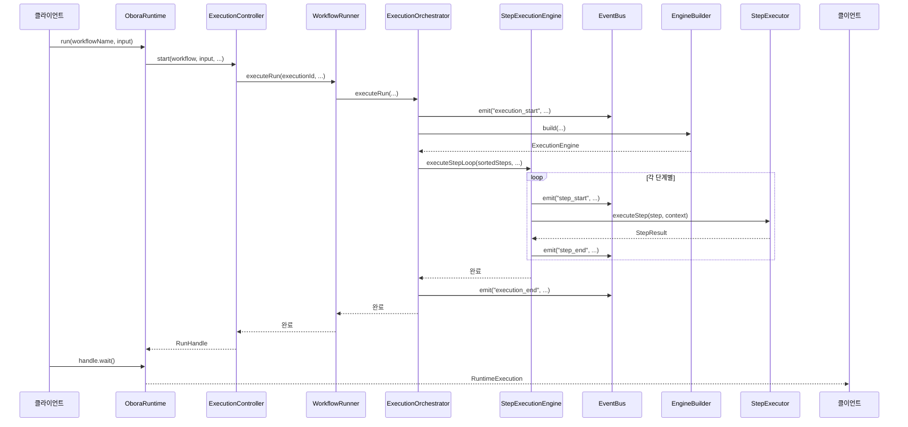
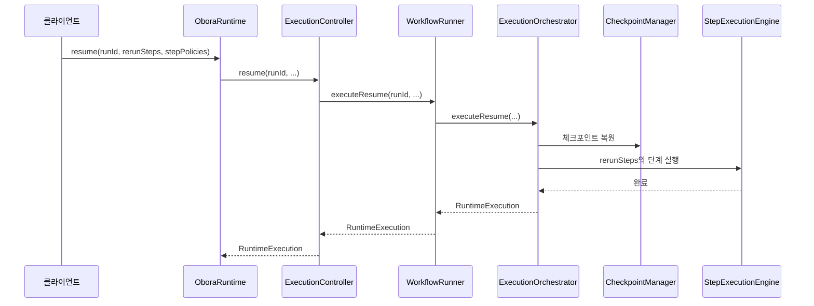

# Obora SDK 아키텍처

## 목차

- [개요](#개요)
- [모듈 구조](#모듈-구조)
- [실행 흐름](#실행-흐름)
- [핵심 모듈](#핵심-모듈)
- [데이터 흐름](#데이터-흐름)
- [확장 가이드](#확장-가이드)

---

## 개요

Obora SDK는 AI 기반 워크플로우 실행 엔진입니다. 선언적인 방식으로 다단계 워크플로우를 정의하고, LLM 기반 에이전트로 실행하며, 영속성, 모니터링, 복구를 관리합니다.

### 주요 책임

- **워크플로우 정의**: YAML/JSON 기반 워크플로우 작성 (단계 의존성, 병렬 실행, 실패 처리)
- **실행 오케스트레이션**: 워크플로우 실행의 전체 라이프사이클 관리 (설정, 단계 실행, 종료)
- **LLM 통합**: 다양한 LLM 제공자를 통합 어댑터 인터페이스 뒤에 추상화
- **영속성**: 실행 기록, 감사 이벤트, 아티팩트의 선택적 저장
- **모니터링**: EventBus를 통한 이벤트 기반 관찰 가능성
- **복구**: 실패 후 체크포인트 기반 재개

### 패키지 경계

SDK (`@obora/sdk`)는 다음에 의존합니다:
- `@obora/runtime`: 저수준 런타임 프리미티브 (저장소, 체크포인팅)
- `@obora/adapters`: LLM 제공자 구현체

---

## 모듈 구조

### 의존성 그래프 (간소화)

```
┌─────────────────────────────────────────────────────────────┐
│                        OboraRuntime                          │
│  (파사드 - 워크플로우 등록, 공개 API)                       │
└──────────────┬──────────────────────────────────────────────┘
               │
       ┌───────▼────────┐
       │ ExecutionController │
       │ (라이프사이클 관리)│
       └───────┬────────┘
               │
       ┌───────▼────────┐
       │  WorkflowRunner  │
       │  (엔진 조합자)   │
       └───────┬────────┘
               │
    ┌──────────┼──────────┐
    │          │          │
┌───▼───┐ ┌───▼───┐ ┌───▼────┐
│Execution│ │ Step   │ │  TKG   │
│Orchestrator│ │Execution│ │Service │
│        │ │Engine  │ │        │
└────────┘ └────────┘ └────────┘
    │          │          │
    │    ┌─────┘          │
    │    │                │
┌───▼────▼───┐      ┌────▼────┐
│ EngineBuilder │      │TKGPromotion│
│              │      │  Engine    │
└──────────────┘      └────────────┘
```

### 모듈 목록

| 모듈 | 파일 | 책임 |
|------|------|------|
| **ExecutionOrchestrator** | `execution/execution-orchestrator.ts` | 고수준 워크플로우 실행/재개 오케스트레이션 |
| **StepExecutionEngine** | `execution/step-execution-engine.ts` | 핵심 단계 실행 로직, 백엣지 라우팅 |
| **EngineBuilder** | `execution/engine-builder.ts` | 실행별 실행 엔진 구성 |
| **TKGPromotionEngine** | `execution/tkg-promotion-engine.ts` | TKG 체크포인팅 및 프로모션 |
| **TKGService** | `execution/tkg-service.ts` | TKG 저장소 해석 및 작업 |
| **PersistenceCoordinator** | `execution/persistence-coordinator.ts` | 오류 시점 영속성 |
| **RepairLoopTracker** | `execution/repair-loop-tracker.ts` | 복구 루프 상태 추적 |
| **ExecutionController** | `execution/execution-controller.ts` | 실행 라이프사이클 관리 |
| **WorkflowRunner** | `execution/workflow-runner.ts` | 모든 엔진을 조합하는 얇은 파사드 |

---

## 실행 흐름

### 시퀀스 다이어그램: `OboraRuntime.run()`



### 시퀀스 다이어그램: `OboraRuntime.resume()`



---

## 핵심 모듈

### ExecutionOrchestrator

**책임:**
- `run()` 및 `resume()`의 전체 워크플로우 라이프사이클 오케스트레이션
- 블랙보드, 옵저버, 리플렉터 라이프사이클 관리
- 지식 컨텍스트 주입 처리
- 공유 메모리 스냅샷 임포트
- 단계 실행을 StepExecutionEngine에 위임
- 실행 종료 및 완료 이벤트 발생

**주요 메서드:**
- `executeRun()` — 전체 워크플로우 실행
- `executeResume()` — 복원된 상태로 재실행
- `injectKnowledgeContext()` — 이전 지식을 입력에 연결
- `importSharedMemory()` — 공유 메모리를 블랙보드에 로드

**의존성:**
- `WorkflowRunnerDeps` — 설정, eventBus, adapterFactory, persistenceManager, agents
- `TKGService` — TKG 저장소 해석
- `TKGPromotionEngine` — TKG 체크포인팅
- `StepExecutionEngine` — 단계 실행 로직
- `EngineBuilder` — 엔진 구성
- `RepairLoopTracker` — 복구 루프 상태

---

### StepExecutionEngine

**책임:**
- 순차 및 병렬 단계 루프 실행
- 백엣지 라우팅 처리 (`on_fail.goto` 및 재시도 제한)
- 검증 및 복구 루프 관리
- 워크플로우 훅 실행 (pre_step, post_step, pre_validation, post_cycle)
- 블랙보드에서 실패 패턴 추출
- 블랙보드 스냅샷 및 옵저버 메트릭 요약

**주요 메서드:**
- `executeStepLoop()` — 백엣지 지원 순차 실행
- `executeParallelStepLoop()` — 레이어 기반 병렬 실행
- `buildRepairContext()` — 단계별 복구 컨텍스트 구성
- `resolveValidationResult()` — 검증 출력 정규화
- `runStepHook()` — 워크플로우 훅 실행
- `extractFailurePatterns()` — 실패 이력 분석

**의존성:**
- `EventBus` — 이벤트 발생
- `OboraRuntimeConfig` — 설정
- `RepairLoopTracker` — 복구 루프 상태

---

### EngineBuilder

**책임:**
- 설정 로드 및 해석 (명시적, 파일, 환경)
- LLM 자격 증명 해석 및 어댑터 해석자 구축
- YAML 파일에서 에이전트 정의 로드
- 에이전트별 LLM 해석이 포함된 StepExecutor 구성
- 리소스가 구성된 경우 비용 추적 설정
- 시작 진단 발생 (바인딩 미리보기, 출력 미리보기)

**주요 메서드:**
- `build()` — 실행을 위한 ExecutionEngine 구성
- `buildResolveAgentLLM()` — 에이전트별 LLM 설정 해석

**의존성:**
- `OboraRuntimeConfig` — 설정
- `EventBus` — 이벤트 발생
- `adapterFactory` — LLM 어댑터 생성
- `PersistenceManager` — 비용 추적 어댑터
- `agents` — 등록된 에이전트

---

### TKGPromotionEngine

**책임:**
- TKG 엔티티에 대한 결정적 ID 생성 (SHA1 해시)
- 구성된 저장소에 공유 메모리 스냅샷 유지
- 구성된 트리거에서 프로모션 체크포인트 플러시
- 프로모션 적용 전 롤백 항목 관리
- 충돌 후보에 대한 검토 대기열 항목 등록
- `DEBUG_ENV_VAR`가 설정된 경우 디버그 이벤트 발생

**주요 메서드:**
- `flushTKGPromotionCheckpoint()` — 평가 및 프로모션 적용
- `persistSharedMemory()` — 공유 메모리 저장소에 스냅샷 저장
- `buildDeterministicTKGId()` — 일관된 ID 생성

**의존성:**
- `EventBus` — 이벤트 발생

---

### PersistenceCoordinator

**책임:**
- 오류 경로에 대한 영속성 로직 캡슐화
- 오류 세부 정보 및 복구 루프 요약이 포함된 실행 기록 저장
- 경고 로깅으로 영속성 실패를 우아하게 처리

**주요 메서드:**
- `saveRunOnError()` — 실패한 실행을 영구 저장소에 저장

**의존성:**
- `PersistenceManager` — 저장소 어댑터 접근
- `logger` — 선택적 경고 로거

---

### RepairLoopTracker

**책임:**
- 실행별 검증 실패/통과 카운터 추적
- 복구 시도, 백엣지 트리거, 소진 기록
- 최근 실패 이력 유지 (마지막 5개)
- 외부 변경 방지를 위해 복제된 요약 제공

**주요 메서드:**
- `recordValidationFailure()` — 검증 실패 로깅
- `recordValidationPass()` — 검증 통과 로깅
- `recordRepairStarted()` — 복구 시작 로깅
- `recordRepairCompleted()` — 복구 완료 로깅
- `recordBackEdgeTriggered()` — 백엣지 트리거 로깅
- `recordBackEdgeExhausted()` — 백엣지 소진 로깅
- `getSummary()` — 복제된 요약 가져오기
- `clearSummary()` — 요약 제거

**의존성:** 없음 (순수 상태 모듈)

---

## 데이터 흐름

### 워크플로우 실행 데이터 흐름

```
┌──────────────┐
│   WorkflowDef │ (name, steps[], variables, hooks)
└──────┬───────┘
       │
       ▼
┌──────────────┐
│  EngineBuilder │ → 설정 해석, 에이전트 로드, StepExecutor 구축
└──────┬───────┘
       │
       ▼
┌──────────────┐
│ ExecutionEngine │ (stepExecutor, costTracker, loadedConfig, llmConfig)
└──────┬───────┘
       │
       ▼
┌──────────────┐
│   Blackboard   │ (세션 범위 상태: facts, failures, stepOutputs, stepTimings)
└──────┬───────┘
       │
       ▼
┌──────────────┐
│ ExecutionObserver │ (메트릭: stepMetrics, totalBackEdges, totalRepairs)
└──────┬───────┘
       │
       ▼
┌──────────────┐
│   Reflector    │ (실패 패턴 분석, 힌트 제공)
└───────────────┘
```

### 이벤트 흐름

모든 주요 실행 이벤트는 `EventBus`를 통해 게시됩니다:

| 이벤트 | 발생자 | 데이터 |
|-------|---------|------|
| `execution_start` | ExecutionOrchestrator | workflowName, input, variables |
| `execution_end` | ExecutionOrchestrator | workflowName, status, report |
| `step_start` | StepExecutionEngine | stepName, agent |
| `step_end` | StepExecutionEngine | stepName, status, durationMs |
| `knowledge_context_attached` | ExecutionOrchestrator | count, minConfidence |
| `tkg.checkpoint` | TKGPromotionEngine | trigger, evaluationMode, candidateCount |
| `tkg.apply` | TKGPromotionEngine | scopes, appliedFactCount |
| `tkg.rollback` | TKGPromotionEngine | rollbackCount, scope |
| `tkg.review_queue` | TKGPromotionEngine | queuedItems |
| `warning` | 다양한 | message, code, severity |

---

## 확장 가이드

### 새로운 실행 전략 추가

1. `src/execution/strategies/`에 새 파일 생성
2. 전략 인터페이스 구현:
   ```typescript
   export interface ExecutionStrategy {
     name: string;
     execute(
       steps: WorkflowStep[],
       executor: StepExecutor,
       context: ExecutionContext
     ): Promise<StepResult[]>;
   }
   ```
3. `ParallelScheduler.buildExecutionPlan()`에 등록

### 새로운 TKG 프로모션 트리거 추가

1. `runtime-types.ts`의 `TKGPromotionTrigger` 유니언에 트리거 유형 추가
2. `TKGService.resolveTKGPromotionTriggers()`에 새 트리거 포함
3. `ExecutionOrchestrator.executeRun()`에서 새 이벤트 구독

### 새로운 훅 라이프사이클 추가

1. `hooks.ts`의 `WorkflowHookLifecycle` 유니언에 추가
2. `workflow.ts`의 `WORKFLOW_HOOK_KEYS`에 추가
3. `StepExecutionEngine.executeStepLoop()`의 적절한 시점에 호출
4. 새 훅 메트릭을 추적하도록 `ExecutionObserver` 업데이트

---

## 순환 의존성 해결

SDK는 이전에 20개의 순환 의존성이 있었습니다. 다음을 통해 해결되었습니다:

1. **순수 타입 모듈 추출** (`runtime-types.ts`, `step-executor-types.ts`)
2. **리프 모듈 추출** (`runtime-errors.ts`)
3. **공유 타입 이동** — 타입 허브로
4. **엔진 추출** — `workflow-runner.ts`에서 전용 모듈로
5. **인터페이스를 통한 위임** — 구체적 import 대신

현재 상태: **남은 낮부 SDK 순환 의존성 0개**.

---

*최종 업데이트: 2026-05-04*
