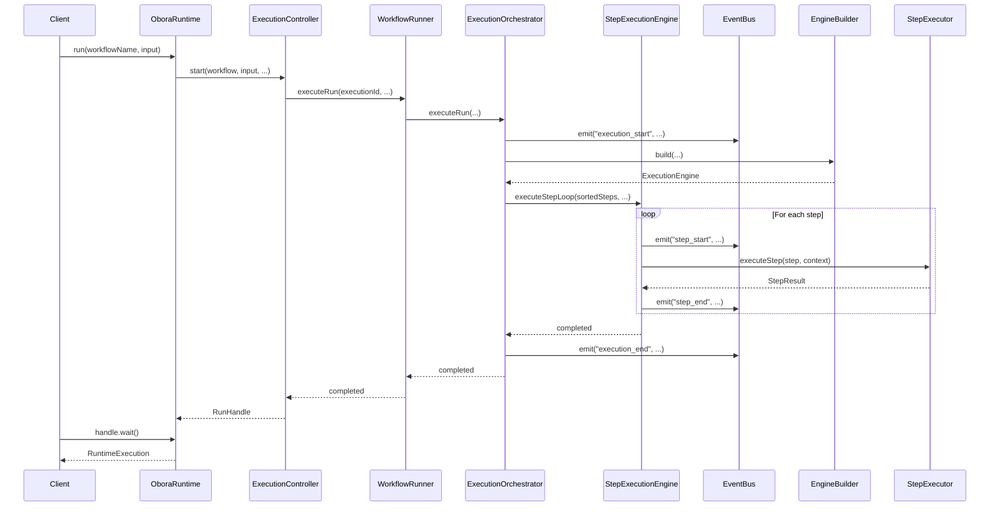
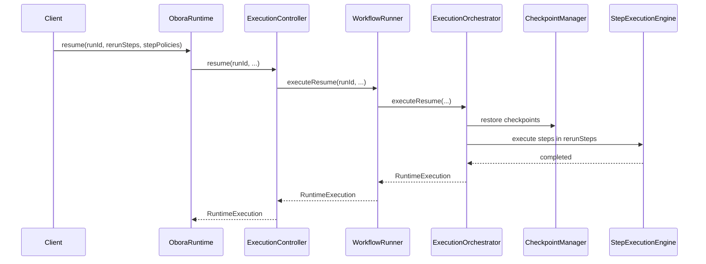

# Obora SDK Architecture

## Table of Contents

- [Overview](#overview)
- [Module Structure](#module-structure)
- [Execution Flow](#execution-flow)
- [Core Modules](#core-modules)
- [Data Flow](#data-flow)
- [Extension Guide](#extension-guide)

---

## Overview

The Obora SDK is a workflow execution engine for AI-driven processes. It provides a declarative way to define multi-step workflows, execute them with LLM-powered agents, and manage persistence, monitoring, and recovery.

### Key Responsibilities

- **Workflow Definition**: YAML/JSON-based workflow authoring with step dependencies, parallel execution, and failure handling
- **Execution Orchestration**: Manages the full lifecycle of workflow runs including setup, step execution, and finalization
- **LLM Integration**: Abstracts multiple LLM providers behind a unified adapter interface
- **Persistence**: Optional storage of execution history, audit events, and artifacts
- **Monitoring**: Event-driven observability via the EventBus
- **Recovery**: Checkpoint-based resume after failures

### Package Boundary

The SDK (`@obora/sdk`) depends on:
- `@obora/runtime`: Low-level runtime primitives (storage, checkpointing)
- `@obora/adapters`: LLM provider implementations

---

## Module Structure

### Dependency Graph (Simplified)

```
┌─────────────────────────────────────────────────────────────┐
│                        OboraRuntime                          │
│  (Facade - workflow registration, public API)               │
└──────────────┬──────────────────────────────────────────────┘
               │
       ┌───────▼────────┐
       │ ExecutionController │
       │ (Lifecycle management)│
       └───────┬────────┘
               │
       ┌───────▼────────┐
       │  WorkflowRunner  │
       │  (Engine composer)│
       └───────┬────────┘
               │
    ┌──────────┼──────────┐
    │          │          │
┌───▼───┐ ┌───▼───┐ ┌───▼────┐
│Execution│ │ Step   │ │  TKG   │
│Orchestrator│ │Execution│ │Service │
│        │ │Engine  │ │        │
└────────┘ └────────┘ └────────┘
    │          │          │
    │    ┌─────┘          │
    │    │                │
┌───▼────▼───┐      ┌────▼────┐
│ EngineBuilder │      │TKGPromotion│
│              │      │  Engine    │
└──────────────┘      └────────────┘
```

### Module List

| Module | File | Responsibility |
|--------|------|----------------|
| **ExecutionOrchestrator** | `execution/execution-orchestrator.ts` | High-level workflow run/resume orchestration |
| **StepExecutionEngine** | `execution/step-execution-engine.ts` | Core step execution logic, back-edge routing |
| **EngineBuilder** | `execution/engine-builder.ts` | Construction of execution engines per run |
| **TKGPromotionEngine** | `execution/tkg-promotion-engine.ts` | TKG checkpointing and promotion |
| **TKGService** | `execution/tkg-service.ts` | TKG store resolution and operations |
| **PersistenceCoordinator** | `execution/persistence-coordinator.ts` | Error-time persistence |
| **RepairLoopTracker** | `execution/repair-loop-tracker.ts` | Repair loop state tracking |
| **ExecutionController** | `execution/execution-controller.ts` | Run lifecycle management |
| **WorkflowRunner** | `execution/workflow-runner.ts` | Thin facade composing all engines |

---

## Execution Flow

### Sequence Diagram: `OboraRuntime.run()`



### Sequence Diagram: `OboraRuntime.resume()`



---

## Core Modules

### ExecutionOrchestrator

**Responsibilities:**
- Orchestrates the full workflow lifecycle for `run()` and `resume()`
- Manages blackboard, observer, and reflector lifecycle
- Handles knowledge context injection
- Imports shared memory snapshots
- Delegates step execution to StepExecutionEngine
- Finalizes execution and emits completion events

**Key Methods:**
- `executeRun()` — Full workflow execution
- `executeResume()` — Re-execution with restored state
- `injectKnowledgeContext()` — Attach prior knowledge to inputs
- `importSharedMemory()` — Load shared memory into blackboard

**Dependencies:**
- `WorkflowRunnerDeps` — Config, eventBus, adapterFactory, persistenceManager, agents
- `TKGService` — TKG store resolution
- `TKGPromotionEngine` — TKG checkpointing
- `StepExecutionEngine` — Step execution logic
- `EngineBuilder` — Engine construction
- `RepairLoopTracker` — Repair loop state

---

### StepExecutionEngine

**Responsibilities:**
- Executes sequential and parallel step loops
- Handles back-edge routing (`on_fail.goto` with retry limits)
- Manages validation and repair loops
- Executes workflow hooks (pre_step, post_step, pre_validation, post_cycle)
- Extracts failure patterns from blackboard
- Summarizes blackboard snapshots and observer metrics

**Key Methods:**
- `executeStepLoop()` — Sequential execution with back-edge support
- `executeParallelStepLoop()` — Parallel execution via layers
- `buildRepairContext()` — Build repair context for a step
- `resolveValidationResult()` — Normalize validation output
- `runStepHook()` — Execute workflow hooks
- `extractFailurePatterns()` — Analyze failure history

**Dependencies:**
- `EventBus` — Event emission
- `OboraRuntimeConfig` — Configuration
- `RepairLoopTracker` — Repair loop state

---

### EngineBuilder

**Responsibilities:**
- Loads and resolves configuration (explicit, file, env)
- Resolves LLM credentials and builds adapter resolver
- Loads agent definitions from YAML files
- Constructs StepExecutor with per-agent LLM resolution
- Sets up cost tracking when resources are configured
- Emits startup diagnostics (binding preview, output preview)

**Key Methods:**
- `build()` — Construct ExecutionEngine for a run
- `buildResolveAgentLLM()` — Per-agent LLM configuration resolution

**Dependencies:**
- `OboraRuntimeConfig` — Configuration
- `EventBus` — Event emission
- `adapterFactory` — LLM adapter creation
- `PersistenceManager` — Cost tracking adapter
- `agents` — Registered agents

---

### TKGPromotionEngine

**Responsibilities:**
- Builds deterministic IDs for TKG entities (SHA1 hash)
- Persists shared memory snapshots to configured stores
- Flushes promotion checkpoints on configured triggers
- Manages rollback entries before applying promotions
- Enqueues review queue items for conflicting candidates
- Emits debug events when `DEBUG_ENV_VAR` is set

**Key Methods:**
- `flushTKGPromotionCheckpoint()` — Evaluate and apply promotions
- `persistSharedMemory()` — Save snapshots to shared memory stores
- `buildDeterministicTKGId()` — Generate consistent IDs

**Dependencies:**
- `EventBus` — Event emission

---

### PersistenceCoordinator

**Responsibilities:**
- Encapsulates persistence logic for error paths
- Saves run records with error details and repair loop summaries
- Gracefully handles persistence failures by logging warnings

**Key Methods:**
- `saveRunOnError()` — Save failed run to persistent storage

**Dependencies:**
- `PersistenceManager` — Storage adapter access
- `logger` — Optional warning logger

---

### RepairLoopTracker

**Responsibilities:**
- Tracks per-execution counters for validation failures/passes
- Records repair attempts, back-edge triggers, and exhaustion
- Maintains recent failure history (last 5)
- Provides cloned summaries to prevent external mutation

**Key Methods:**
- `recordValidationFailure()` — Log validation failure
- `recordValidationPass()` — Log validation pass
- `recordRepairStarted()` — Log repair start
- `recordRepairCompleted()` — Log repair completion
- `recordBackEdgeTriggered()` — Log back-edge trigger
- `recordBackEdgeExhausted()` — Log back-edge exhaustion
- `getSummary()` — Get cloned summary
- `clearSummary()` — Remove summary

**Dependencies:** None (pure state module)

---

## Data Flow

### Workflow Execution Data Flow

```
┌──────────────┐
│   WorkflowDef │ (name, steps[], variables, hooks)
└──────┬───────┘
       │
       ▼
┌──────────────┐
│  EngineBuilder │ → resolves config, loads agents, builds StepExecutor
└──────┬───────┘
       │
       ▼
┌──────────────┐
│ ExecutionEngine │ (stepExecutor, costTracker, loadedConfig, llmConfig)
└──────┬───────┘
       │
       ▼
┌──────────────┐
│   Blackboard   │ (session-scoped state: facts, failures, stepOutputs, stepTimings)
└──────┬───────┘
       │
       ▼
┌──────────────┐
│ ExecutionObserver │ (metrics: stepMetrics, totalBackEdges, totalRepairs)
└──────┬───────┘
       │
       ▼
┌──────────────┐
│   Reflector    │ (analyzes failure patterns, provides hints)
└───────────────┘
```

### Event Flow

All significant execution events are published via the `EventBus`:

| Event | Emitter | Data |
|-------|---------|------|
| `execution_start` | ExecutionOrchestrator | workflowName, input, variables |
| `execution_end` | ExecutionOrchestrator | workflowName, status, report |
| `step_start` | StepExecutionEngine | stepName, agent |
| `step_end` | StepExecutionEngine | stepName, status, durationMs |
| `knowledge_context_attached` | ExecutionOrchestrator | count, minConfidence |
| `tkg.checkpoint` | TKGPromotionEngine | trigger, evaluationMode, candidateCount |
| `tkg.apply` | TKGPromotionEngine | scopes, appliedFactCount |
| `tkg.rollback` | TKGPromotionEngine | rollbackCount, scope |
| `tkg.review_queue` | TKGPromotionEngine | queuedItems |
| `warning` | Various | message, code, severity |

---

## Extension Guide

### Adding a New Execution Strategy

1. Create a new file in `src/execution/strategies/`
2. Implement the strategy interface:
   ```typescript
   export interface ExecutionStrategy {
     name: string;
     execute(
       steps: WorkflowStep[],
       executor: StepExecutor,
       context: ExecutionContext
     ): Promise<StepResult[]>;
   }
   ```
3. Register in `ParallelScheduler.buildExecutionPlan()`

### Adding a New TKG Promotion Trigger

1. Add trigger type to `TKGPromotionTrigger` union in `runtime-types.ts`
2. Update `TKGService.resolveTKGPromotionTriggers()` to include new trigger
3. Subscribe to new event in `ExecutionOrchestrator.executeRun()`

### Adding a New Hook Lifecycle

1. Add to `WorkflowHookLifecycle` union in `hooks.ts`
2. Add to `WORKFLOW_HOOK_KEYS` in `workflow.ts`
3. Call in `StepExecutionEngine.executeStepLoop()` at appropriate point
4. Update `ExecutionObserver` to track new hook metrics

---

## Circular Dependency Resolution

The SDK previously had 20 circular dependencies. They were resolved by:

1. **Extracting pure type modules** (`runtime-types.ts`, `step-executor-types.ts`)
2. **Extracting leaf modules** (`runtime-errors.ts`)
3. **Moving shared types** to type hubs
4. **Extracting engines** from `workflow-runner.ts` to dedicated modules
5. **Delegating via interfaces** instead of concrete imports

Current state: **0 internal SDK circular dependencies**.

---

*Last updated: 2026-05-04*
