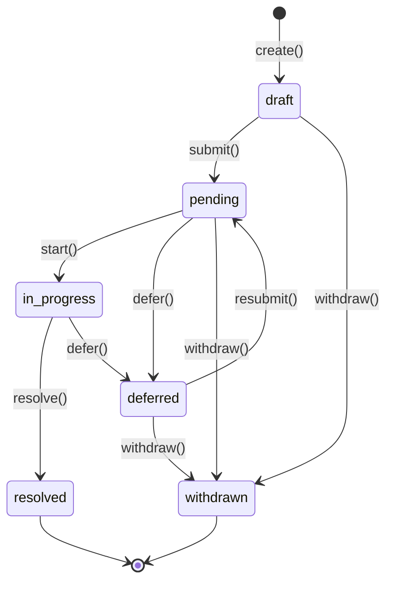

# TASK-036: @obora-kit/board - Agenda Management System

## 개요
- **상태**: 📋 대기
- 우선순위: P1
- 예상 소요: 6시간
- 담당: 개발자

## 목표
AI 이사회 시스템의 안건(Agenda) 관리 기능을 구현합니다. 안건 제출, 철회, 우선순위 관리, 마감 시간 설정 등의 핵심 기능을 제공합니다.

## 작업 내용

### 1. AgendaManager 클래스 구현

**파일 위치:** `packages/board/src/agenda/AgendaManager.ts`

#### 인터페이스 정의

```typescript
// packages/board/src/types/agenda.ts
export interface Agenda {
  // 기본 정보
  id: string;
  title: string;
  description: string;

  // 제안자
  proposer: string;

  // 상태
  status: AgendaStatus;

  // 설정
  priority: AgendaPriority;
  votingMethod: VotingMethod;
  requiredQuorum: number;   // 최소 참여자 수

  // 시간
  createdAt: Date;
  updatedAt: Date;
  startedAt?: Date;
  resolvedAt?: Date;
  deadline?: Date;

  // 첨부
  attachments: Attachment[];
  tags: string[];

  // 결과
  resolution?: Resolution;
}

export interface Attachment {
  id: string;
  name: string;
  type: string;
  url?: string;
  content?: string;
  uploadedAt: Date;
  uploadedBy: string;
}

// 스펙: [[15-board-system.md]]#agenda-타입
export type AgendaPriority = 'low' | 'medium' | 'high' | 'critical';

export type AgendaStatus =
  | 'draft'       // 초안 (아직 제출 안됨)
  | 'pending'     // 제출됨, 대기 중
  | 'in_progress' // 토론/투표 진행 중
  | 'resolved'    // 결정됨
  | 'deferred'    // 연기됨
  | 'withdrawn';  // 철회됨

export type VotingMethod =
  | 'majority'    // 과반수
  | 'supermajority' // 2/3 이상
  | 'unanimous'   // 만장일치
  | 'weighted'    // 가중치 투표
  | 'ranked';     // 순위 투표 (선호도)

export interface CreateAgendaInput {
  title: string;
  description: string;
  proposer: string;
  priority?: AgendaPriority;
  deadline?: Date;
  votingMethod?: VotingMethod;
  requiredQuorum?: number;
  attachments?: Attachment[];
  tags?: string[];
}

export interface UpdateAgendaInput {
  title?: string;
  description?: string;
  priority?: AgendaPriority;
  deadline?: Date;
  votingMethod?: VotingMethod;
  requiredQuorum?: number;
  attachments?: Attachment[];
  tags?: string[];
}
```

#### AgendaManager 클래스 시그니처

```typescript
export class AgendaManager {
  private agendas: Map<string, Agenda>;
  private eventBus: EventBus;

  constructor(eventBus: EventBus);

  // === CRUD ===
  create(options: CreateAgendaInput): Promise<Agenda>;
  get(id: string): Promise<Agenda | undefined>;
  getAll(filter?: AgendaFilter): Promise<Agenda[]>;
  getCurrent(): Promise<Agenda | null>;
  getPending(): Promise<Agenda[]>;
  update(id: string, updates: UpdateAgendaInput): Promise<Agenda>;

  // === 상태 전이 ===
  submit(id: string): Promise<void>;
  start(id: string): Promise<void>;
  defer(id: string, reason: string): Promise<void>;
  withdraw(id: string, reason: string): Promise<void>;
  resolve(id: string, resolution: Resolution): Promise<void>;

  // === 우선순위 관리 ===
  setPriority(id: string, priority: AgendaPriority): Promise<void>;
  reorder(ids: string[]): Promise<void>;  // 우선순위 재정렬
  prioritize(): Agenda[];  // 우선순위별 정렬

  // === 마감 시간 관리 ===
  setDeadline(id: string, deadline: Date): Agenda;
  checkDeadlines(): ExpiredAgenda[];
  extendDeadline(id: string, extensionMs: number): Agenda;

  // === 검색/필터링 ===
  findByProposer(proposer: string): Agenda[];
  findByStatus(status: AgendaStatus): Agenda[];
  findByPriority(priority: AgendaPriority): Agenda[];
  findByDeadlineRange(start: Date, end: Date): Agenda[];
  findExpired(): Agenda[];
  findUrgent(hoursThreshold?: number): Agenda[];

  // === 이력 조회 ===
  getHistory(id: string): Promise<AgendaHistoryEntry[]>;

  // === 검증 ===
  validateCreate(options: CreateAgendaInput): ValidationResult;
  validateUpdate(id: string, options: UpdateAgendaInput): ValidationResult;

  // === 유틸리티 ===
  exists(id: string): boolean;
  count(filter?: AgendaFilter): number;
  clear(): void;
}

export interface Resolution {
  agendaId: string;
  decision: 'approved' | 'rejected' | 'deferred';
  summary: string;
  voteSummary?: {
    approve: number;
    reject: number;
    abstain: number;
    totalVotes: number;
  };
  conditions?: string[];
  dissent?: string[];
  resolvedAt: Date;
  resolvedBy: string;
}

export interface AgendaFilter {
  proposer?: string;
  status?: AgendaStatus | AgendaStatus[];
  priority?: AgendaPriority | AgendaPriority[];
  deadlineBefore?: Date;
  deadlineAfter?: Date;
  createdBefore?: Date;
  createdAfter?: Date;
}

export interface ExpiredAgenda {
  agenda: Agenda;
  overdueMs: number;
}

export interface ValidationResult {
  isValid: boolean;
  errors: ValidationError[];
}

export interface ValidationError {
  code: string;
  message: string;
  path?: string;
}
```

### 2. 구현 상세

#### 2.1 생성 (create)

```typescript
/**
 * 새로운 안건을 생성합니다.
 *
 * @param options - 안건 생성 옵션
 * @returns 생성된 Agenda 객체
 * @throws {ValidationError} 유효하지 않은 옵션인 경우
 *
 * @example
 * const agenda = agendaManager.create({
 *   title: '신규 서비스 개발 승인',
 *   description: 'Q2에 출시할 신규 서비스에 대한 승인 요청',
 *   proposer: 'ceo',
 *   priority: AgendaPriority.HIGH,
 *   requiredQuorum: 3,
 *   votingMethod: VotingMethod.MAJORITY,
 *   deadline: new Date('2026-03-01')
 * });
 */
create(options: AgendaCreateOptions): Agenda;
```

**검증 규칙:**
- `title`: 필수, 최소 3자, 최대 200자
- `description`: 필수, 최소 10자, 최대 5000자
- `proposer`: 필수, 빈 문자열 불가
- `requiredQuorum`: 최소 2, 최소 전체 이사 수의 50% 이상
- `deadline`: 현재 시간 이후여야 함
- `priority`: 기본값 `AgendaPriority.NORMAL`
- `votingMethod`: 기본값 `VotingMethod.MAJORITY`

**에러 코드:**
- `EMPTY_TITLE`: 제목이 비어있음
- `TITLE_TOO_SHORT`: 제목이 너무 짧음
- `TITLE_TOO_LONG`: 제목이 너무 김
- `EMPTY_DESCRIPTION`: 설명이 비어있음
- `DESCRIPTION_TOO_SHORT`: 설명이 너무 짧음
- `EMPTY_PROPOSER`: 제안자가 비어있음
- `INVALID_QUORUM`: 정족수가 유효하지 않음
- `DEADLINE_IN_PAST`: 마감 시간이 과거임

#### 2.2 상태 전이

```typescript
/**
 * 안건을 제출 상태로 변경합니다.
 *
 * @param id - 안건 ID
 * @returns 업데이트된 Agenda 객체
 * @throws {NotFoundError} 안건을 찾을 수 없음
 * @throws {InvalidStateError} 현재 상태에서 제출 불가
 */
submit(id: string): Agenda;

/**
 * 안건을 철회합니다.
 *
 * @param id - 안건 ID
 * @param reason - 철회 사유 (선택)
 * @returns 업데이트된 Agenda 객체
 * @throws {NotFoundError} 안건을 찾을 수 없음
 * @throws {InvalidStateError} 이미 활성화된 안건은 철회 불가
 */
withdraw(id: string, reason?: string): Agenda;
```

**상태 전이 규칙 (스펙):**



| 현재 상태 | 가능한 전이 | 조건 |
|----------|-----------|------|
| draft | submit, withdraw | - |
| pending | start, defer, withdraw | - |
| in_progress | resolved, defer | 투표/합의 완료 시 |
| resolved | - | 종단 상태 |
| deferred | pending | resubmit (재제출) |
| withdrawn | - | 종단 상태 |

#### 2.3 우선순위 관리

```typescript
/**
 * 안건의 우선순위를 설정합니다.
 *
 * @param id - 안건 ID
 * @param priority - 새로운 우선순위
 * @returns 업데이트된 Agenda 객체
 */
setPriority(id: string, priority: AgendaPriority): Agenda;

/**
 * 우선순위별 정렬된 안건 목록을 반환합니다.
 *
 * 순서: CRITICAL > HIGH > NORMAL > LOW
 * 동일 우선순위 내에서는 마감 시간 기준 정렬
 *
 * @returns 정렬된 안건 목록
 */
prioritize(): Agenda[];
```

#### 2.4 마감 시간 관리

```typescript
/**
 * 안건의 마감 시간을 설정합니다.
 *
 * @param id - 안건 ID
 * @param deadline - 마감 시간
 * @returns 업데이트된 Agenda 객체
 * @throws {ValidationError} 마감 시간이 과거인 경우
 */
setDeadline(id: string, deadline: Date): Agenda;

/**
 * 마감 시간을 연장합니다.
 *
 * @param id - 안건 ID
 * @param extensionMs - 연장할 시간 (밀리초)
 * @returns 업데이트된 Agenda 객체
 */
extendDeadline(id: string, extensionMs: number): Agenda;

/**
 * 마감 시간이 지난 안건 목록을 반환합니다.
 *
 * @returns 만료된 안건 목록
 */
checkDeadlines(): ExpiredAgenda[];
```

#### 2.5 검색/필터링

```typescript
/**
 * 제안자별 안건 목록을 조회합니다.
 *
 * @param proposer - 제안자 ID
 * @returns 안건 목록
 */
findByProposer(proposer: string): Agenda[];

/**
 * 상태별 안건 목록을 조회합니다.
 *
 * @param status - 단일 상태 또는 상태 배열
 * @returns 안건 목록
 */
findByStatus(status: AgendaStatus | AgendaStatus[]): Agenda[];

/**
 * 긴급한 안건 목록을 조회합니다.
 *
 * @param hoursThreshold - 임계 시간 (시간), 기본값 24시간
 * @returns 마감까지 threshold 이내 남은 안건 목록
 */
findUrgent(hoursThreshold?: number): Agenda[];
```

### 3. 이벤트 발행

AgendaManager는 다음 이벤트를 발행합니다:

| 이벤트 이름 | 설명 | 페이로드 |
|-----------|------|---------|
| `agenda.created` | 안건 생성됨 | `{ agenda: Agenda }` |
| `agenda.updated` | 안건 수정됨 | `{ agenda: Agenda, changes: string[] }` |
| `agenda.deleted` | 안건 삭제됨 | `{ agendaId: string }` |
| `agenda.submitted` | 안건 제출됨 | `{ agenda: Agenda }` |
| `agenda.withdrawn` | 안건 철회됨 | `{ agenda: Agenda, reason?: string }` |
| `agenda.scheduled` | 안건 일정 확정 | `{ agenda: Agenda, scheduledAt?: Date }` |
| `agenda.activated` | 안건 활성화됨 | `{ agenda: Agenda }` |
| `agenda.completed` | 안건 완료됨 | `{ agenda: Agenda }` |
| `agenda.deferred` | 안건 보류됨 | `{ agenda: Agenda, reason: string }` |
| `agenda.expired` | 안건 마감됨 | `{ agenda: Agenda, overdueMs: number }` |

### 4. 테스트 케이스

#### 4.1 생성 테스트

```typescript
describe('AgendaManager.create', () => {
  it('should create agenda with valid options', () => {
    const manager = new AgendaManager(eventBus);
    const agenda = manager.create({
      title: '테스트 안건',
      description: '테스트를 위한 안건입니다',
      proposer: 'test-user',
      priority: AgendaPriority.HIGH,
      requiredQuorum: 3,
      votingMethod: VotingMethod.MAJORITY
    });

    expect(agenda.id).toBeDefined();
    expect(agenda.title).toBe('테스트 안건');
    expect(agenda.status).toBe(AgendaStatus.DRAFT);
    expect(agenda.priority).toBe(AgendaPriority.HIGH);
  });

  it('should set default values', () => {
    const manager = new AgendaManager(eventBus);
    const agenda = manager.create({
      title: '테스트',
      description: '테스트 설명',
      proposer: 'user'
    });

    expect(agenda.priority).toBe(AgendaPriority.NORMAL);
    expect(agenda.votingMethod).toBe(VotingMethod.MAJORITY);
    expect(agenda.requiredQuorum).toBe(2); // 기본값
  });

  it('should reject empty title', () => {
    const manager = new AgendaManager(eventBus);

    expect(() => {
      manager.create({
        title: '',
        description: '테스트',
        proposer: 'user'
      });
    }).toThrow('EMPTY_TITLE');
  });

  it('should reject title shorter than 3 characters', () => {
    const manager = new AgendaManager(eventBus);

    expect(() => {
      manager.create({
        title: 'ab',
        description: '테스트',
        proposer: 'user'
      });
    }).toThrow('TITLE_TOO_SHORT');
  });

  it('should reject empty description', () => {
    const manager = new AgendaManager(eventBus);

    expect(() => {
      manager.create({
        title: '테스트',
        description: '',
        proposer: 'user'
      });
    }).toThrow('EMPTY_DESCRIPTION');
  });

  it('should reject deadline in the past', () => {
    const manager = new AgendaManager(eventBus);
    const past = new Date();
    past.setHours(past.getHours() - 1);

    expect(() => {
      manager.create({
        title: '테스트',
        description: '테스트 설명',
        proposer: 'user',
        deadline: past
      });
    }).toThrow('DEADLINE_IN_PAST');
  });

  it('should publish agenda.created event', () => {
    const eventBus = createMockEventBus();
    const manager = new AgendaManager(eventBus);

    manager.create({
      title: '테스트',
      description: '테스트 설명',
      proposer: 'user'
    });

    expect(eventBus.publish).toHaveBeenCalledWith('agenda.created', expect.any(Object));
  });
});
```

#### 4.2 상태 전이 테스트

```typescript
describe('AgendaManager state transitions', () => {
  let manager: AgendaManager;
  let agenda: Agenda;

  beforeEach(() => {
    manager = new AgendaManager(eventBus);
    agenda = manager.create({
      title: '테스트',
      description: '테스트 설명',
      proposer: 'user'
    });
  });

  it('should submit draft agenda', () => {
    const submitted = manager.submit(agenda.id);
    expect(submitted.status).toBe(AgendaStatus.PENDING);
  });

  it('should schedule pending agenda', () => {
    manager.submit(agenda.id);
    const scheduled = manager.schedule(agenda.id);
    expect(scheduled.status).toBe(AgendaStatus.SCHEDULED);
  });

  it('should activate scheduled agenda', () => {
    manager.submit(agenda.id);
    manager.schedule(agenda.id);
    const activated = manager.activate(agenda.id);
    expect(activated.status).toBe(AgendaStatus.ACTIVE);
  });

  it('should complete active agenda', () => {
    manager.submit(agenda.id);
    manager.schedule(agenda.id);
    manager.activate(agenda.id);
    const completed = manager.complete(agenda.id);
    expect(completed.status).toBe(AgendaStatus.COMPLETED);
  });

  it('should withdraw pending agenda', () => {
    manager.submit(agenda.id);
    const withdrawn = manager.withdraw(agenda.id, '사유');
    expect(withdrawn.status).toBe(AgendaStatus.WITHDRAWN);
  });

  it('should defer scheduled agenda', () => {
    manager.submit(agenda.id);
    manager.schedule(agenda.id);
    const deferred = manager.defer(agenda.id, '추가 조사 필요');
    expect(deferred.status).toBe(AgendaStatus.DEFERRED);
  });

  it('should throw error when withdrawing active agenda', () => {
    manager.submit(agenda.id);
    manager.schedule(agenda.id);
    manager.activate(agenda.id);

    expect(() => {
      manager.withdraw(agenda.id);
    }).toThrow('InvalidStateError');
  });

  it('should throw error when submitting non-existent agenda', () => {
    expect(() => {
      manager.submit('non-existent-id');
    }).toThrow('NotFoundError');
  });
});
```

#### 4.3 우선순위 테스트

```typescript
describe('AgendaManager priority management', () => {
  let manager: AgendaManager;

  beforeEach(() => {
    manager = new AgendaManager(eventBus);
  });

  it('should prioritize agendas correctly', () => {
    manager.create({
      title: '낮은 우선순위',
      description: '테스트',
      proposer: 'user',
      priority: AgendaPriority.LOW
    });

    manager.create({
      title: '높은 우선순위',
      description: '테스트',
      proposer: 'user',
      priority: AgendaPriority.HIGH
    });

    manager.create({
      title: '긴급',
      description: '테스트',
      proposer: 'user',
      priority: AgendaPriority.CRITICAL
    });

    const prioritized = manager.prioritize();

    expect(prioritized[0].priority).toBe(AgendaPriority.CRITICAL);
    expect(prioritized[1].priority).toBe(AgendaPriority.HIGH);
    expect(prioritized[2].priority).toBe(AgendaPriority.LOW);
  });

  it('should sort by deadline within same priority', () => {
    const now = new Date();
    const tomorrow = new Date(now.getTime() + 24 * 60 * 60 * 1000);
    const nextWeek = new Date(now.getTime() + 7 * 24 * 60 * 60 * 1000);

    manager.create({
      title: '내일 마감',
      description: '테스트',
      proposer: 'user',
      deadline: tomorrow
    });

    manager.create({
      title: '다음주 마감',
      description: '테스트',
      proposer: 'user',
      deadline: nextWeek
    });

    const prioritized = manager.prioritize();

    expect(prioritized[0].title).toBe('내일 마감');
    expect(prioritized[1].title).toBe('다음주 마감');
  });
});
```

#### 4.4 마감 시간 테스트

```typescript
describe('AgendaManager deadline management', () => {
  let manager: AgendaManager;
  let clock: FakeTimers;

  beforeEach(() => {
    manager = new AgendaManager(eventBus);
    clock = FakeTimers.install();
  });

  afterEach(() => {
    clock.uninstall();
  });

  it('should check expired agendas', () => {
    const now = new Date();
    const past = new Date(now.getTime() - 1000); // 1초 전

    manager.create({
      title: '만료된 안건',
      description: '테스트',
      proposer: 'user',
      deadline: past
    });

    const expired = manager.checkDeadlines();

    expect(expired).toHaveLength(1);
    expect(expired[0].overdueMs).toBeGreaterThan(0);
  });

  it('should extend deadline', () => {
    const agenda = manager.create({
      title: '테스트',
      description: '테스트',
      proposer: 'user',
      deadline: new Date(Date.now() + 3600000) // 1시간 후
    });

    const originalDeadline = agenda.deadline!.getTime();
    const extended = manager.extendDeadline(agenda.id, 7200000); // 2시간 연장

    expect(extended.deadline!.getTime()).toBe(originalDeadline + 7200000);
  });

  it('should find urgent agendas within threshold', () => {
    const now = new Date();
    const in2Hours = new Date(now.getTime() + 2 * 60 * 60 * 1000);
    const in3Hours = new Date(now.getTime() + 3 * 60 * 60 * 1000);

    manager.create({
      title: '2시간 후 마감',
      description: '테스트',
      proposer: 'user',
      deadline: in2Hours
    });

    manager.create({
      title: '3시간 후 마감',
      description: '테스트',
      proposer: 'user',
      deadline: in3Hours
    });

    const urgent = manager.findUrgent(24); // 24시간 기준

    expect(urgent).toHaveLength(2);
  });
});
```

#### 4.5 검색/필터링 테스트

```typescript
describe('AgendaManager search and filter', () => {
  let manager: AgendaManager;

  beforeEach(() => {
    manager = new AgendaManager(eventBus);

    manager.create({
      title: 'CEO 안건',
      description: '테스트',
      proposer: 'ceo',
      priority: AgendaPriority.HIGH
    });

    manager.create({
      title: 'CTO 안건',
      description: '테스트',
      proposer: 'cto',
      priority: AgendaPriority.NORMAL
    });

    manager.create({
      title: 'CFO 안건',
      description: '테스트',
      proposer: 'cfo',
      priority: AgendaPriority.NORMAL
    });
  });

  it('should find by proposer', () => {
    const agendas = manager.findByProposer('ceo');
    expect(agendas).toHaveLength(1);
    expect(agendas[0].proposer).toBe('ceo');
  });

  it('should find by status', () => {
    manager.submit(manager.getAll()[0].id);

    const pending = manager.findByStatus(AgendaStatus.PENDING);
    const drafts = manager.findByStatus(AgendaStatus.DRAFT);

    expect(pending).toHaveLength(1);
    expect(drafts).toHaveLength(2);
  });

  it('should find by priority', () => {
    const highPriority = manager.findByPriority(AgendaPriority.HIGH);
    const normalPriority = manager.findByPriority(AgendaPriority.NORMAL);

    expect(highPriority).toHaveLength(1);
    expect(normalPriority).toHaveLength(2);
  });

  it('should find by multiple statuses', () => {
    const first = manager.getAll()[0];
    const second = manager.getAll()[1];

    manager.submit(first.id);
    manager.schedule(second.id);

    const result = manager.findByStatus([
      AgendaStatus.PENDING,
      AgendaStatus.SCHEDULED
    ]);

    expect(result).toHaveLength(2);
  });
});

#### 4.6 우선순위 재정렬 테스트 (reorder)

```typescript
describe('AgendaManager reorder', () => {
  let manager: AgendaManager;

  beforeEach(() => {
    manager = new AgendaManager(eventBus);

    manager.create({
      title: '안건 3',
      description: '테스트',
      proposer: 'user',
      priority: AgendaPriority.LOW
    });

    manager.create({
      title: '안건 1',
      description: '테스트',
      proposer: 'user',
      priority: AgendaPriority.HIGH
    });

    manager.create({
      title: '안건 2',
      description: '테스트',
      proposer: 'user',
      priority: AgendaPriority.NORMAL
    });
  });

  it('should reorder agendas by custom order', async () => {
    const agendas = manager.getAll();
    const ids = agendas.map(a => a.id);

    // 순서: 안건2 -> 안건1 -> 안건3
    const customOrder = [ids[2], ids[1], ids[0]];

    await manager.reorder(customOrder);

    const reordered = manager.getAll();
    expect(reordered[0].id).toBe(customOrder[0]);
    expect(reordered[1].id).toBe(customOrder[1]);
    expect(reordered[2].id).toBe(customOrder[2]);
  });
});
```
```

### 5. 파일 구조

```
packages/board/
├── src/
│   ├── agenda/
│   │   ├── AgendaManager.ts
│   │   └── index.ts
│   └── types/
│       └── agenda.ts
└── test/
    └── agenda/
        ├── AgendaManager.test.ts
        └── index.test.ts
```

### 6. 완료 조건

- [ ] AgendaManager 클래스 구현 완료
- [ ] 모든 상태 전이 구현 완료
- [ ] 우선순위 정렬 기능 구현 완료
- [ ] **reorder() 메서드 구현 완료** (스펙 추가)
- [ ] **tags 필드 지원** (스펙 추가)
- [ ] 마감 시간 관리 기능 구현 완료
- [ ] 검색/필터링 기능 구현 완료
- [ ] **이력 조회 기능 구현 완료** (getHistory)
- [ ] 이벤트 발행 구현 완료
- [ ] 테스트 커버리지 80% 이상
- [ ] pnpm test 성공
- [ ] TypeScript 타입 체크 통과
- [ ] ESLint 통과

### 7. 의존성

- TASK-019 (EventBus 구현)
- @obora-kit/core 패키지

### 8. 참고 문서

- [Blackboard Actor Design](../../architecture/blackboard-actor-design.md)
- [Phase 4: Board System](../../architecture/blackboard-actor-design.md#64-phase-4-board-system-week-7-8)
