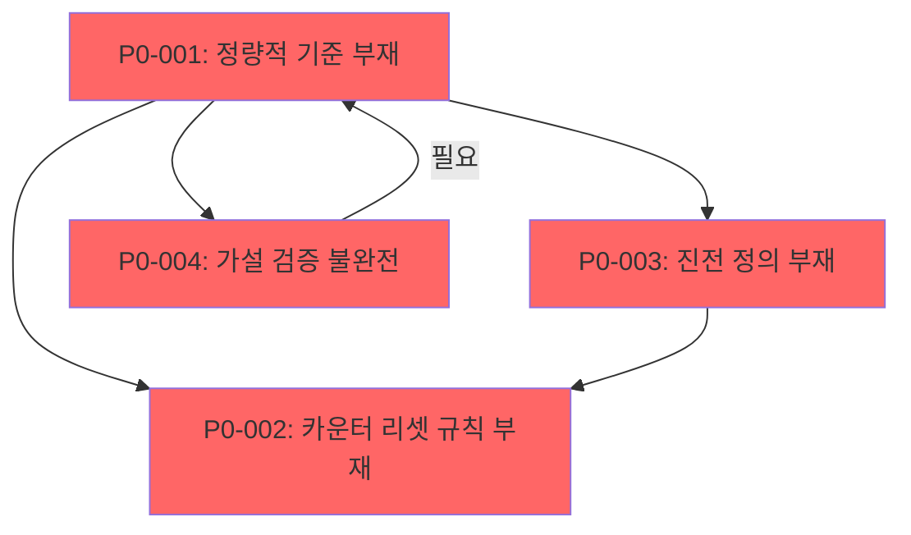

# P0 Gap Analysis

## 개요

이 문서는 현재 STOP 조건 충족을 방해하는 4개의 P0 문제(P0-001, P0-002, P0-003, P0-004)를 정량화하고, 각 문제가 STOP 결정을 차단하는 이유를 명시한다.

---

## P0-001: 정량적 검증 기준 부재 (Quantitative Criteria Gap)

### 문제 정의
P0/P1 이슈 분류 및 검증 기준의 정량적 기준이 부재하여 객관적 PASS/FAIL 판정이 불가능한 상황.

### 현재 상황
- Review Report(20-review-report.md)에서 P0 이슈 식별 기준: "치명적" (critical) - 루프 종료를 차단하거나 핵심 결론을 무효화하는 이슈
- "치명적"의 정량적 정의 부재: 예를 들어 "연구 질문 답변률 < 50%", "결론-문제정의 불일치", "근거 부족" 등의 구체적 임계값 미정

### STOP 차단 사유
| 요구사항 | 현재 상태 | 차단 이유 |
|----------|----------|-----------|
| Review PASS/FAIL 판정 | FAIL → PASS 요구 | 정량적 기준 없이 PASS 판정 불가 |
| P0 이슈 수 | 4개 → 0개 요구 | P0-001 자체가 P0 이슈로 존재 |
| Loop policy `no-progress-ceiling` | 감지 불가 | "실질 개선 없음"의 정량적 정의 부재 |

### 영향 범위
- Q-001: 카운터 초기화 조건 (카운터 리셋 규칙의 기준 불명확)
- Q-002: P0/P1 이슈 분류 정량화 (본 문제 직접 해당)
- Q-003: 진전 판단 기준 (진전 여부의 객관적 측정 불가)

---

## P0-002: 카운터 리셋 규칙 부재 (Counter Reset Rule Gap)

### 문제 정의
안전 종료 조건에서 사용되는 두 카운터(`no-progress-ceiling`, `repeated-critical-issue-ceiling`)의 초기화 및 리셋 조건이 정의되지 않아 루프 정상 종료 판단이 불가능한 상황.

### 현재 상황
- Loop Policy 정의: "3회 연속 실질 개선 없음", "동일 핵심 이슈 2회 이상 반복" 시 안전 종료
- 리셋 조건 미정의:
  - `no-progress-ceiling`: 언제 0으로 리셋되는가?
  - `repeated-critical-issue-ceiling`: 동일 이슈가 "해결됨"으로 표시되었을 때 리셋되는가? 아니면 다른 이슈가 해결되어도 리셋되는가?

### STOP 차단 사유
| 요구사항 | 현재 상태 | 차단 이유 |
|----------|----------|-----------|
| 안전 종료 조건 명확성 | 불확실 | 카운터 값의 신뢰성 없이 STOP 결정 불가 |
| 루프 무한 반복 방지 | 미보장 | 부정확한 카운터로 인한 의도치 않은 종료 또는 비종료 가능성 |
| Iteration별 진전 추적 | 불가 | 진전 여부 판정의 기준이 불명확하여 `no-progress-ceiling` 감지 불가 |

### 영향 범위
- Q-001: 카운터 초기화 조건 (본 문제 직접 해당)
- Loop 정책 전체의 안정성 (카운터 오작동 시 의도치 않은 루프 종료 또는 비종료)

---

## P0-003: 진전(Progress) 정의 부재 (Progress Definition Gap)

### 문제 정의
Iteration 간 "실질 개선"의 정량적 정의가 부재하여 `no-progress-ceiling`가 정상적으로 작동하지 않는 상황.

### 현재 상황
- Loop Policy 정의: "3회 연속 실질 개선 없음" 시 안전 종료
- "실질 개선"의 정량적 기준 미정의:
  - Remediation Plan 제안:
    - 미해결 질문 수 감소
    - 가설 해결 단계 진전 (pending → partial → supported)
    - P0 이슈 수 감소
  - 그러나 이 중 "어떤 지표가 개선되면 실질 개선으로 인정할 것인가"에 대한 명확한 우선순위 및 측정 방법 미정

### STOP 차단 사유
| 요구사항 | 현재 상태 | 차단 이유 |
|----------|----------|-----------|
| `no-progress-ceiling` 감지 | 불가 | 개선 여부 판정의 객관적 기준 부재 |
| 루프 종료 조건 충족 여부 확인 | 불가 | 개선이 없는 상태가 지속되는지 감지 불가 |
| Iteration 효율성 평가 | 불가 | 개선이 있는지 없는지 판단 불가하여 리소스 낭비 가능성 |

### 영향 범위
- Q-003: 진전 판단 기준 (본 문제 직접 해당)
- Loop Policy 전체의 효율성 (무의미한 iteration 반복 방지 불가)

---

## P0-004: 가설 검증 불완전 (Hypothesis Verification Gap)

### 문제 정의
핵심 가설(H-002, H-003)의 검증이 불완전하여 연구의 결론적 신뢰성이 확보되지 않은 상황.

### 현재 상황
- H-002 (ceiling 조합): "부분 지지" - 어떤 조합이 수렴을 보장하는지 완전히 규명되지 않음
- H-003 (iteration 증가 시 컨텍스트 붕괴): "검증 보류" - 실제 데이터 없이 가정으로만 존재
- 연구의 핵심 주장인 "수렴 보장 메커니즘"의 완성도 부족

### STOP 차단 사유
| 요구사항 | 현재 상태 | 차단 이유 |
|----------|----------|-----------|
| 모든 가설 최종 상태 확정 | 3/5 완료 | H-002, H-003가 "부분"/"보류" 상태로 STOP 불가 |
| 수렴 보장 근거 명확성 | 불충분 | 수렴 보장의 최소 충분 조건 미규명 |
| 연구 결론의 신뢰성 | 제한적 | 핵심 가설 검증 불완전으로 인한 결론 근거 약화 |

### 영향 범위
- 연구 결론의 신뢰성 전체 (수렴 보장이 보장되지 않으면 시스템의 안정성 입증 불가)
- Q-004: 컨텍스트 붕괴 실측 (H-003과 직접 연관)

---

## P0 문제 간 의존관계

### 의존관계 설명
1. **P0-001 → P0-002**: 정량적 기준이 없으면 카운터 리셋 규칙의 정의가 불가능
2. **P0-001 → P0-003**: 정량적 기준이 없으면 진전 판단 기준을 정의할 수 없음
3. **P0-003 → P0-002**: 진전 판단 기준이 없으면 `no-progress-ceiling` 카운터를 정상적으로 운영할 수 없음
4. **P0-001 → P0-004**: 정량적 기준이 없으면 가설 검증의 완결성을 입증할 수 없음 (H-002의 ceiling 조합 테스트, H-003의 컨텍스트 보존률 실측 불가)

---

## STOP 차단 요약

| P0 ID | 문제 | STOP 차단 경로 | 해결 우선순위 |
|-------|------|----------------|---------------|
| P0-001 | 정량적 검증 기준 부재 | Review PASS 판정 불가 → STOP 차단 | 1 (최우선) |
| P0-002 | 카운터 리셋 규칙 부재 | 안전 종료 조건 불명확 → STOP 차단 | 2 |
| P0-003 | 진전 정의 부재 | `no-progress-ceiling` 감지 불가 → STOP 차단 | 2 |
| P0-004 | 가설 검증 불완전 | 결론 근거 불충분 → STOP 차단 | 1 |

### 최우선 해결 필요 항목
1. **P0-001**: 정량적 검증 기준 수립 (다른 모든 P0 문제의 선행 조건)
2. **P0-004**: H-002, H-003 가설 검증 완료 (연구 결론의 신뢰성 확보)

---

## 해결 로드맵

### Iteration 2 목표
1. **P0-001 해결**: 정량적 검증 기준 수립
   - P0 이슈 분류 기준 정량화
   - 진전 판단 기준 정의

2. **P0-004 해결**: 가설 검증 완료
   - H-002: ceiling 조합 테스트 수행
   - H-003: 컨텍스트 보존률 실측

3. **P0-002, P0-003 해결**: 파생적 해결
   - P0-001 해결 시 자연스럽게 해결 가능

### Iteration 2 성공 기준
- P0-001: 정량적 기준 정의 및 적용 완료
- P0-002: 카운터 리셋 규칙 정의 및 적용 완료
- P0-003: 진전 판단 기준 정의 및 적용 완료
- P0-004: H-002, H-003 가설 최종 상태 확정

---

## 결론

현재 4개의 P0 문제가 모두 STOP 결정을 차단하고 있으며, 이 중 P0-001(정량적 검증 기준 부재)이 가장 선행적이고 파급력이 큰 문제이다. P0-001 해결 시 P0-002, P0-003이 파생적으로 해결 가능하므로, Iteration 2에서 P0-001과 P0-004에 집중하여 STOP 조건 충족을 목표로 한다.
