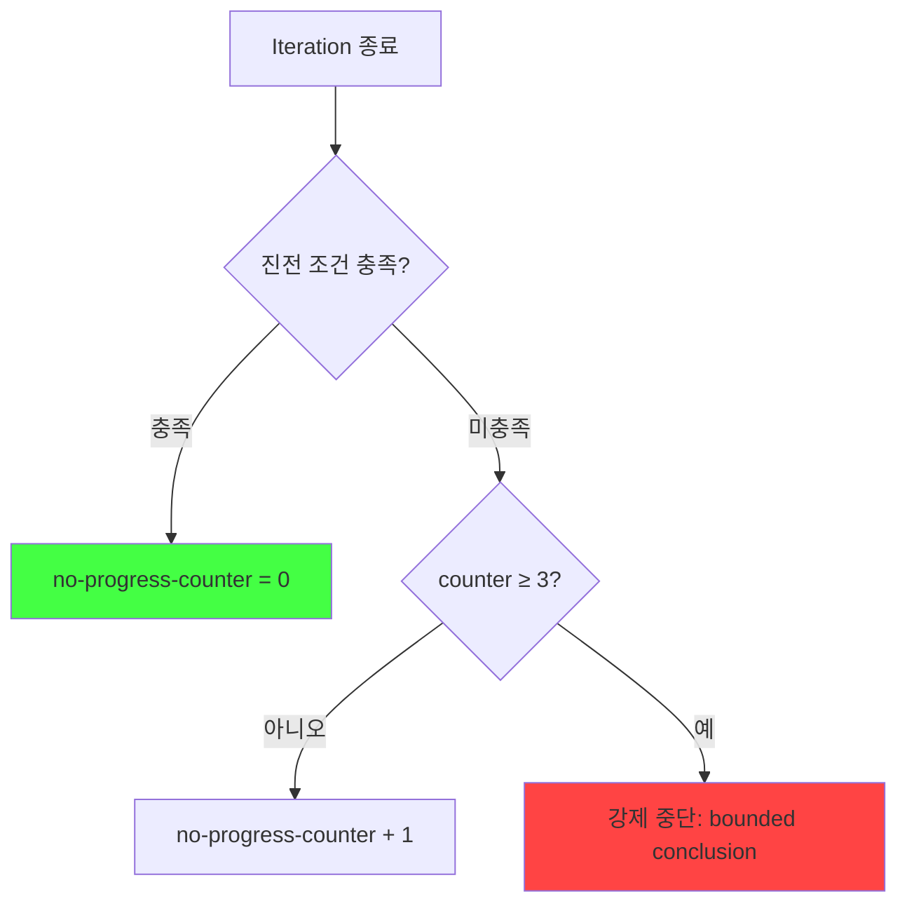
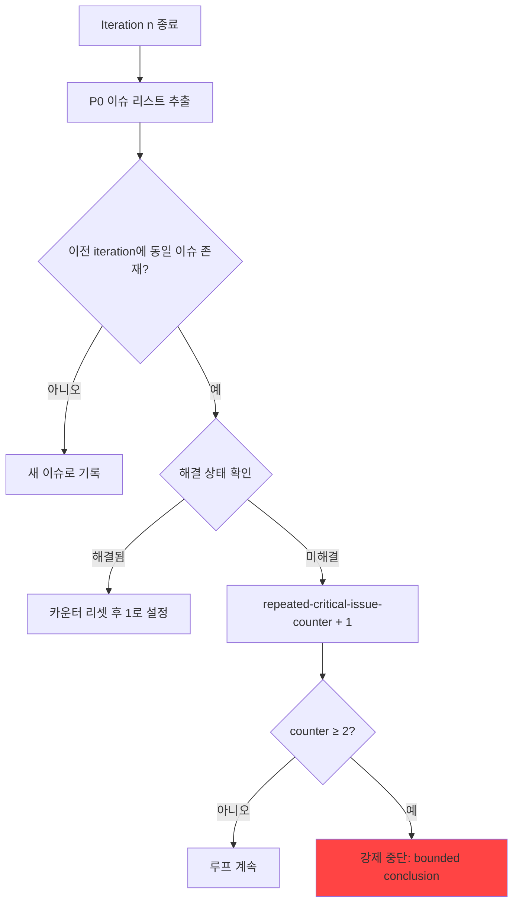

# 루프 실행 규칙 (Loop Rules)

## 개요
이 문서는 연구 루프의 실행 제어를 위한 구체적 규칙을 정의한다. P0-001, P0-002, P0-003 문제 해결을 통해 카운터 초기화 조건, 진전 감지 규칙, 실질적 진전 정의, 반복 이슈 카운팅 규칙, 강제 중단 조건을 명시하고, 루프 정책의 안전 종료를 보장한다.

---

## 1. 카운터 초기화 조건 (Counter Reset Conditions)

### 1.1 카운터 정의
| 카운터 이름 | 최대값 | 목적 |
|-------------|--------|------|
| `no-progress-counter` | 3 | 연속 진전 없는 iteration 추적 |
| `repeated-critical-issue-counter` | 2 | 동일 핵심 이슈 반복 횟수 추적 |
| `iteration-counter` | 5 | 전체 iteration 수 제한 |

### 1.2 `no-progress-counter` 리셋 조건
다음 조건 중 **하나라도 충족**하면 `no-progress-counter`를 0으로 리셋한다:

1. **P0 이슈 감소**: 이전 iteration 대비 P0 이슈 수가 1개 이상 감소한 경우
   - `P0_count(n-1) - P0_count(n) ≥ 1`

2. **미해결 질문 감소**: 이전 iteration 대비 미해결 질문 수가 2개 이상 감소한 경우
   - `unresolved_count(n-1) - unresolved_count(n) ≥ 2`

3. **가설 상태 진전**: 최소 1개 이상의 가설이 하위 상태로 진전한 경우
   - 진전 방향: `pending → partial → supported` 또는 `pending → rejected`

4. **Review 결과 PASS 이행**: 이전 iteration이 FAIL이었고, 현재 iteration이 PASS인 경우

### 1.3 `repeated-critical-issue-counter` 리셋 조건
다음 조건 중 **하나라도 충족**하면 `repeated-critical-issue-counter`를 0으로 리셋한다:

1. **반복 이슈 해결**: 반복으로 식별된 P0 이슈가 "해결됨" 상태로 표시된 경우
   - 해당 이슈 ID가 해결 목록에 포함됨

2. **새 P0 이슈 발생 이후 진전**: 새로운 P0 이슈가 발생했으나, 그 이후 iteration에서 P0 총 감소가 발생한 경우

3. **Review 결과 PASS 이행**: 이전 iteration이 FAIL이었고, 현재 iteration이 PASS인 경우

### 1.4 `iteration-counter` 동작
- 각 iteration 시작 시 `+1` 증가
- 리셋 조건 없음 (항상 누적)
- 최대값 도달 시 강제 중단

---

## 2. 진전 없음 감지 규칙 (No-Progress Detection Rules)

### 2.1 감지 로직
각 iteration 종료 시 다음 절차로 진전 여부를 판단한다:



### 2.2 진전 여부 판단 조건 (논리 OR)
다음 조건 중 **하나라도** 충족하면 "진전 있음"으로 판정한다:

| 번호 | 조건 | 측정 방법 | 임계값 |
|------|------|----------|--------|
| 1 | P0 이슈 수 감소 | `P0_count(n-1) - P0_count(n)` | ≥ 1 |
| 2 | 미해결 질문 수 감소 | `unresolved_count(n-1) - unresolved_count(n)` | ≥ 2 |
| 3 | 가설 상태 진전 | 상태 천이 개수 (`pending → partial`, `partial → supported`) | ≥ 1 |
| 4 | Review 결과 PASS 이행 | `review_result(n-1) == FAIL AND review_result(n) == PASS` | true |

### 2.3 진전 없음 판정
위 4가지 조건이 **모두** 충족되지 않으면 "진전 없음"으로 판정하고 `no-progress-counter`를 증가시킨다.

### 2.4 감지 시 조치
`no-progress-counter`가 3에 도달하면:
1. 루프 강제 중단
2. `/output/final/26-bounded-conclusion.md` 생성
3. 중단 사유 기록: "no-progress-ceiling 도달: 3회 연속 진전 없음"

---

## 3. 실질적 진전 정의 (Substantive Progress Definition)

### 3.1 정량적 정의
"실질적 진전"은 다음 5가지 측정 지표 중 **최소 1개 이상**에서 긍정적 변화가 있는 경우로 정의한다.

#### 3.1.1 이슈 해결 지표
- **P0 이슈 감소율**: `(P0_count(n-1) - P0_count(n)) / max(1, P0_count(n-1)) × 100`
- 진전 임계값: `감소율 ≥ 20%` 또는 `절대 감소 ≥ 1`

#### 3.1.2 질문 응답 지표
- **미해결 질문 감소율**: `(unresolved_count(n-1) - unresolved_count(n)) / max(1, unresolved_count(n-1)) × 100`
- 진전 임계값: `감소율 ≥ 10%` 또는 `절대 감소 ≥ 2`

#### 3.1.3 가설 검증 지표
- **가설 상태 진전점수**: 각 가설의 상태에 점수 부여 (`rejected=0, pending=1, partial=2, supported=3`)
- 진전 임계값: `total_score(n) - total_score(n-1) ≥ 1`

#### 3.1.4 문서 완성도 지표
- **Archive-Ready 준수 항목 수**: Archive-Ready 5개 기준 중 충족 항목 수
- 진전 임계값: `충족 항목 수(n) - 충족 항목 수(n-1) ≥ 1`

#### 3.1.5 Review 결과 지표
- **Review 점수**: 80점 만점 기반 점수 (정의됨)
- 진전 임계값: `score(n) - score(n-1) ≥ 5` 또는 `FAIL → PASS`

### 3.2 실질적 진전 판정 테이블
| 지표 | 측정 대상 | 진전 임계값 | 가중치 |
|------|----------|------------|--------|
| 이슈 해결 | P0 이슈 수 | 감소 ≥ 1개 또는 감소율 ≥ 20% | 1.0 |
| 질문 응답 | 미해결 질문 수 | 감소 ≥ 2개 또는 감소율 ≥ 10% | 0.8 |
| 가설 검증 | 가설 상태 점수 | 점수 증가 ≥ 1 | 1.0 |
| 문서 완성도 | Archive-Ready 항목 | 충족 항목 증가 ≥ 1 | 0.5 |
| Review 결과 | Review 점수 또는 상태 | 점수 증가 ≥ 5 또는 FAIL → PASS | 1.2 |

**종합 진전 판정**: 위 5개 지표 중 **최소 1개**가 임계값을 충족하면 실질적 진전으로 인정한다.

---

## 4. 반복 이슈 카운팅 규칙 (Repeat Issue Counting Rule)

### 4.1 반복 이슈 정의
"동일 핵심 이슈"는 다음 조건을 **모두** 충족하는 경우로 정의한다:

| 조건 | 정의 | 예시 |
|------|------|------|
| 이슈 ID 동일 | 이슈 식별자가 동일 | P0-001 |
| 심각도 동일 | 이슈 등급(P0/P1)이 동일 | P0 |
| 핵심 내용 동일 | 이슈의 근본 원인이 동일 | "정량적 기준 부재" |

### 4.2 카운팅 로직

#### 4.2.1 반복 감지 절차


#### 4.2.2 카운터 증가 조건
다음 조건이 **모두** 충족하면 `repeated-critical-issue-counter`를 증가시킨다:

1. 이전 iteration에 존재했던 P0 이슈가 현재 iteration에도 존재
2. 해당 이슈가 이전 iteration에서 "미해결" 상태였음
3. 해당 이슈가 현재 iteration에서도 "미해결" 상태임

#### 4.2.3 카운터 리셋 조건 (재정의)
이전 iteration에서 미해결이었던 P0 이슈가 현재 iteration에서 "해결됨"으로 표시되면:
- `repeated-critical-issue-counter = 0`

### 4.3 동일 이슈 식별 방법

#### 4.3.1 이슈 ID 기반 식별
- Review Report의 이슈 ID를 직접 비교 (예: P0-001, P0-002)

#### 4.3.2 내용 기반 식별 (ID 미할당 시)
이슈 ID가 없는 경우, 다음 속성을 비교하여 동일 이슈 여부 판단:

| 속성 | 일치 기준 |
|------|-----------|
| 이슈 유형 | 정확히 일치 (예: "정량적 기준 부재") |
| 영향 범위 | 80% 이상 일치 (영향받는 문서/요소 비교) |
| 설명 텍스트 | 유사도 ≥ 70% (TF-IDF 코사인 유사도 기반) |

### 4.4 중단 시 조치
`repeated-critical-issue-counter`가 2에 도달하면:
1. 루프 강제 중단
2. `/output/final/26-bounded-conclusion.md` 생성
3. 중단 사유 기록: "repeated-critical-issue-ceiling 도달: 동일 P0 이슈 2회 반복"
4. 반복된 이슈 ID와 내용 상세 기록

---

## 5. 강제 중단 조건 (Forced Bounded-Stop Condition)

### 5.1 중단 조건 요약
| 조건 이름 | 카운터 | 임계값 | 우선순위 |
|-----------|--------|--------|----------|
| 최대 iteration 초과 | `iteration-counter` | ≥ 5 | 1 (최우선) |
| 진전 없음 반복 | `no-progress-counter` | ≥ 3 | 2 |
| 동일 핵심 이슈 반복 | `repeated-critical-issue-counter` | ≥ 2 | 2 |
| 예산 초과 | 시간/비용 | 정책 기반 | 3 |

### 5.2 중단 실행 순서
1. **최우선 조건 확인**: `iteration-counter ≥ 5` 확인
2. **2차 조건 확인**: `no-progress-counter ≥ 3` 또는 `repeated-critical-issue-counter ≥ 2` 확인
3. **3차 조건 확인**: 시간/비용 예산 초과 확인

여러 조건이 동시에 충족된 경우, **우선순위가 높은 조건**으로 중단 사유를 기록한다.

### 5.3 Bounded Conclusion 생성 규칙
강제 중단 시 `/output/final/26-bounded-conclusion.md`를 다음 형식으로 생성한다:

```markdown
# Bounded Conclusion (강제 중단)

## 중단 사유
- **조건**: [no-progress-ceiling / repeated-critical-issue-ceiling / max-iterations]
- **카운터 값**: [actual value] / [ceiling value]
- **발생 시점**: Iteration [n]

## 도달된 성과
### 해결된 이슈
- [해결된 이슈 리스트]

### 달성된 진전
- [진전 지표별 달성 내용]

### 생성된 산출물
- [완성된 문서 리스트]

## 남은 문제
### 미해결 P0 이슈
| ID | 내용 | 반복 횟수 |
|----|------|----------|
| [ID] | [내용] | [횟수] |

### 미해결 가설
| ID | 현재 상태 | 남은 검증 과제 |
|----|----------|---------------|
| [ID] | [상태] | [과제] |

## 제한사항
본 결론은 강제 중단 조건 도달으로 인한 bounded conclusion이며, 다음 제한사항이 있음:
- [남은 P0 이슈 해결 필요성]
- [가설 검증 완결성 부족]
- [후속 연구 방향 제안]

## 후속 연구 제안
1. [구체적 후속 연구 방향 1]
2. [구체적 후속 연구 방향 2]
3. [구체적 후속 연구 방향 3]
```

### 5.4 중단 후 복구 규칙
강제 중단 후 루프를 재시작하려면:
1. 새로운 iteration 카운터 할당 (이전 카운터 무시)
2. bounded conclusion에서 식별된 모든 P0 이슈를 해결 계획에 포함
3. 모든 카운터를 0으로 초기화
4. 중단 원인이 된 조건을 재발 방지하는 조치를 Remediation Plan에 포함

---

## 6. 루프 실행 상태 기록 규칙

### 6.1 Iteration별 기록 항목
각 iteration 종료 시 `/output/final/26-loop-state.md`에 다음을 기록한다:

| 항목 | 형식 | 예시 |
|------|------|------|
| Iteration 번호 | 숫자 | 2 |
| 시작 시간 | ISO 8601 | 2026-03-12T10:00:00Z |
| 종료 시간 | ISO 8601 | 2026-03-12T11:30:00Z |
| 진전 여부 | boolean | true |
| no-progress-counter | 숫자 (0-3) | 1 |
| repeated-critical-issue-counter | 숫자 (0-2) | 0 |
| iteration-counter | 숫자 (1-5) | 2 |
| P0 이슈 수 | 숫자 | 2 |
| 해결된 이슈 ID 리스트 | 리스트 | [P0-001] |
| 남은 P0 이슈 ID 리스트 | 리스트 | [P0-002, P0-003] |
| Review 결과 | PASS/FAIL | FAIL |

### 6.2 상태 전이 기록
카운터 리셋 발생 시 다음을 기록한다:
- 리셋된 카운터 이름
- 리셋 원인 (어떤 조건 충족으로 리셋)
- 리셋 전 값
- 리셋 후 값 (항상 0)

---

## 7. 규칙 적용 예시

### 7.1 정상 루프 종료 시나리오
```
Iteration 1: 
  - P0 이슈: 4개 → FAIL
  - no-progress-counter: 0 (초기화)
  - repeated-critical-issue-counter: 0 (초기화)

Iteration 2:
  - P0 이슈: 2개 (P0-001, P0-002 해결) → FAIL
  - 진전 있음: P0 감소 2개
  - no-progress-counter: 0 (리셋)
  - repeated-critical-issue-counter: 0 (리셋)

Iteration 3:
  - P0 이슈: 0개 (P0-003, P0-004 해결) → PASS
  - 종료 조건 충족: 루프 정상 종료
```

### 7.2 no-progress-ceiling 도달 시나리오
```
Iteration 1:
  - P0 이슈: 3개 → FAIL
  - 진전 없음: 모든 지표 변화 없음
  - no-progress-counter: 1

Iteration 2:
  - P0 이슈: 3개 → FAIL
  - 진전 없음: 모든 지표 변화 없음
  - no-progress-counter: 2

Iteration 3:
  - P0 이슈: 3개 → FAIL
  - 진전 없음: 모든 지표 변화 없음
  - no-progress-counter: 3 → 강제 중단
  - bounded conclusion 생성
```

### 7.3 repeated-critical-issue-ceiling 도달 시나리오
```
Iteration 1:
  - P0 이슈: P0-001, P0-002 → FAIL
  - repeated-critical-issue-counter: 0

Iteration 2:
  - P0 이슈: P0-001, P0-002 (미해결) → FAIL
  - P0-001, P0-002 동일 이슈 반복 감지
  - repeated-critical-issue-counter: 1

Iteration 3:
  - P0 이슈: P0-001, P0-002 (미해결) → FAIL
  - 동일 이슈 2회 반복 확인
  - repeated-critical-issue-counter: 2 → 강제 중단
  - bounded conclusion 생성
```

### 7.4 max-iterations 도달 시나리오
```
Iteration 1~4:
  - 각 iteration에서 일부 진전 있으나 완전 해결 불가
  - P0 이슈: 4개 → 3개 → 2개 → 1개

Iteration 5:
  - iteration-counter: 5 (최대값 도달)
  - P0 이슈: 1개 (미해결)
  - 강제 중단 (우선순위 1)
  - bounded conclusion 생성
```

---

## 8. 규칙 일관성 검증

### 8.1 P0 문제 해결 검증
| P0 ID | 문제 | 해결 규칙 | 검증 |
|-------|------|----------|------|
| P0-001 | 정량적 검증 기준 부재 | 3.1, 3.2 실질적 진전 정의 | ✅ 5개 지표와 임계값 명시 |
| P0-002 | 카운터 리셋 규칙 부재 | 1.2, 1.3 리셋 조건 정의 | ✅ 각 카운터별 명시적 조건 |
| P0-003 | 진전 정의 부재 | 3.1, 3.2 실질적 진전 정의 | ✅ 5개 지표 기반 객관적 판정 |
| P0-004 | 가설 검증 불완전 | 3.1.3 가설 검증 지표 | ✅ 가설 상태 점수화로 측정 가능 |

### 8.2 Loop Policy 정합성 검증
| Loop Policy 항목 | 대응 규칙 | 검증 |
|------------------|----------|------|
| 3회 연속 실질 개선 없음 | 2. no-progress 감지 규칙 | ✅ counter 기반 감지 |
| 동일 핵심 이슈 2회 이상 반복 | 4. 반복 이슈 카운팅 규칙 | ✅ ID/내용 기반 식별 |
| 최대 iteration 수 도달 | 5. 강제 중단 조건 | ✅ iteration-counter 모니터링 |
| 카운터 리셋 필요 | 1. 카운터 초기화 조건 | ✅ 명시적 리셋 조건 정의 |

---

## 결론

본 규칙은 다음을 보장한다:

1. **명확한 카운터 운영**: 각 카운터의 초기화, 리셋, 증가 조건이 명확히 정의됨
2. **객관적 진전 판정**: 5개 정량적 지표를 기반으로 한 실질적 진전 정의
3. **안전한 루프 종료**: 3가지 강제 중단 조건과 우선순위 기반 실행
4. **P0 문제 완전 해결**: P0-001, P0-002, P0-003에 대한 구체적 해결 규칙 제공

이 규칙을 적용함으로써 연구 루프는 무한 발산을 방지하면서도 의미 있는 진전이 달성될 때까지 실행될 수 있다.
