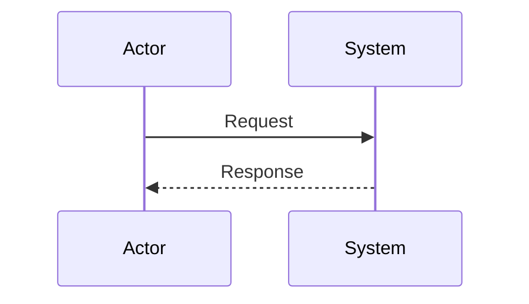

# reddit-feed - 설계서 (Design)

> 생성일: 2026-02-14
> 상태: draft

## 아키텍처

<!-- 전체 아키텍처 설명 -->

## 컴포넌트

### 컴포넌트 1

- 역할:
- 책임:

## 데이터 모델

```typescript
// 데이터 모델 정의
```

## API 설계

### Endpoint 1

- Method: GET
- Path: /api/v1/example
- Request:
- Response:

## 시퀀스 다이어그램



## 결정 사항

| 결정 | 이유 | 대안 |
|------|------|------|
| 결정 1 | 이유 1 | 대안들 |

## 참고 자료

- [관련 문서](link)
